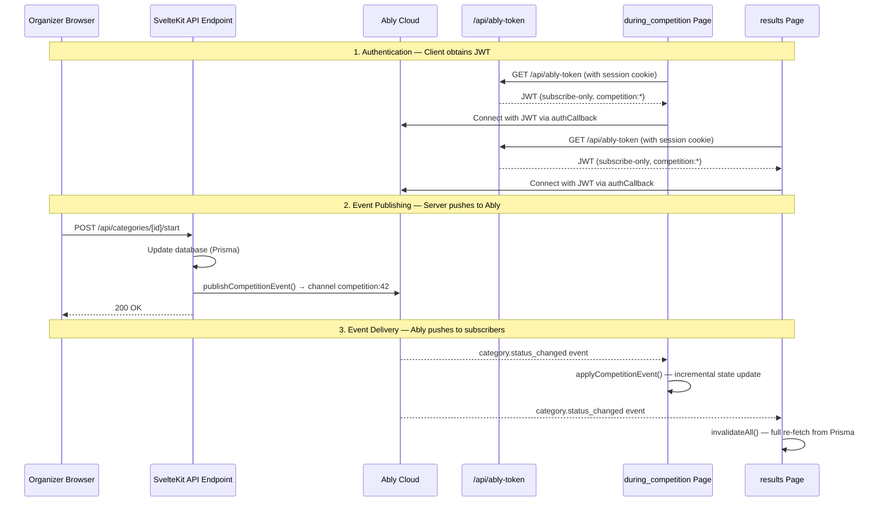

# Ably Pub/Sub — Real-Time Event System

Puzzle League uses [Ably Pub/Sub](https://ably.com/docs/pub-sub) to deliver real-time competition updates to connected clients. When an organizer starts a category, records a finish time, or changes a category status, the update is pushed instantly to every browser viewing that competition — no polling required.

## Architecture Overview



## Server-Side: Event Publishing

### Publisher Module

File: `src/lib/events/server/ably.ts`

Uses a **lazy singleton** `Ably.Rest` client initialized with the `ABLY_API_KEY` environment variable. The `publishCompetitionEvent()` function is **fire-and-forget**: errors are logged but never thrown, ensuring API endpoints always succeed regardless of Ably availability.

```typescript
publishCompetitionEvent(competitionId: number, eventName: string, data: Record<string, unknown>): void
```

### Channel Naming

All competition events are published to channels named `competition:{competitionId}`, for example `competition:42`. This follows Ably's [channel namespace](https://ably.com/docs/channels#channel-namespaces) convention — the `competition` prefix acts as a namespace, enabling wildcard capability rules like `competition:*`.

### API Endpoints That Publish Events

| Endpoint | Event Name | Key Data Fields |
|----------|-----------|----------------|
| `api/categories/[id]/start` | `category.status_changed` | `categoryId`, `competitionId`, `status`, `realStartTime` |
| `api/categories/[id]/stop` | `category.status_changed` | `categoryId`, `competitionId`, `status`, `realEndTime` |
| `api/categories/[id]/resume` | `category.status_changed` | `categoryId`, `competitionId`, `status`, `realEndTime: null` |
| `api/categories/[id]/complete` | `category.status_changed` | `categoryId`, `competitionId`, `status` |
| `api/categories/[id]/cancel` | `category.status_changed` | `categoryId`, `competitionId`, `status` |
| `api/categories/[id]/restart` | `category.status_changed` | `categoryId`, `competitionId`, `status`, `realStartTime`, `realEndTime: null` |
| `api/records/[id]/result` | `record.finished` | `recordId`, `categoryId`, `competitionId`, `finishTime` |
| `api/records/[id]/pieces` | `record.pieces_updated` | `recordId`, `categoryId`, `competitionId`, `nPiecesCompleted` |

### Event Types

Defined in `src/lib/events/types.ts`:

**`category.status_changed`** — Fired when a category transitions between states (NOT_STARTED → LIVE → STOPPED → COMPLETE, etc.). Carries the new status and optional timing fields.

**`record.finished`** — Fired when a participant's finish time is recorded. Carries the `finishTime` ISO string.

**`record.pieces_updated`** — Fired when a DNF participant's piece count is updated. Does not change category-level state, but signals the results page to re-fetch detailed data.

## Authentication & Token Generation

### Why JWT Authentication

Per [Ably's official documentation](https://ably.com/docs/auth):

> **Never use API keys in client-side code.** API keys don't expire; once compromised, they grant indefinite access. Use token authentication with tokens that have narrowly-scoped capabilities, are short-lived, and can be revoked.

Puzzle League uses **JWT-based token authentication**, which is [Ably's recommended approach](https://ably.com/docs/auth/token/jwt) for most applications:

- No Ably SDK required on the server — uses Node.js `node:crypto` directly
- Stateless and ideal for serverless environments
- Supports channel-scoped claims and per-connection rate limits

### Token Endpoint

File: `src/routes/(internal)/api/ably-token/+server.ts`

**Endpoint:** `GET /api/ably-token`
**Auth required:** Yes (session cookie)
**Response:** Raw JWT string with `Content-Type: application/jwt`

The endpoint:
1. Validates the user is authenticated via `event.locals.user`
2. Extracts the Ably key name (`kid`) and secret from `ABLY_API_KEY`
3. Constructs a JWT with the following claims:

| Claim | Value | Purpose |
|-------|-------|---------|
| `x-ably-capability` | `{ "competition:*": ["subscribe"] }` | Restricts to subscribe-only on competition channels |
| `x-ably-clientId` | `user.id` | Ties the token to a specific authenticated user |
| `iat` | Current Unix timestamp | Issued-at time |
| `exp` | `iat + 3600` (1 hour) | Token expiry — Ably SDK auto-renews before expiry |

4. Signs with **HMAC-SHA256** using the Ably key secret portion
5. Returns the JWT with `Cache-Control: no-store` to prevent caching

### Auto-Renewal

The Ably SDK automatically calls the `authCallback` to fetch a new token before the current one expires, maintaining uninterrupted connections. This is handled transparently by `AblyAdapter`.

## Client-Side: Transport Layer

### AblyAdapter

File: `src/lib/events/client/ably-adapter.ts`

A wrapper around `Ably.Realtime` that:

- Authenticates via `authCallback` → `GET /api/ably-token` (with cookies)
- Subscribes to a single channel and forwards all messages via `onMessage` callback
- Maps Ably's internal connection states to the application's `ConnectionStatus`:

| Ably State | App Status | Meaning |
|------------|-----------|---------|
| `connected` | `connected` | Active connection, receiving messages |
| `connecting` | `connecting` | Initial connection or reconnecting quickly |
| `disconnected` | `reconnecting` | Temporarily lost, SDK will auto-reconnect |
| `suspended` | `error` | Extended disconnection — may have missed messages |
| `failed` | `error` | Unrecoverable error (auth failure, etc.) |
| `closed` | `disconnected` | Explicitly disconnected by the app |

Exposes `wasSuspended` to detect if messages may have been missed during disconnection.

### useAblyStream() Hook

File: `src/lib/events/client/use-ably-stream.svelte.ts`

A **Svelte 5 runes-based** hook for competition channels:

1. Receives initial `CompetitionEventState` from SvelteKit's `load()` function
2. Subscribes to the Ably channel via `AblyAdapter`
3. Applies incoming events **incrementally** using `applyCompetitionEvent()` — a pure reducer that immutably updates category status, finish counts, and timing fields
4. On reconnection after a **suspension** (missed messages possible): calls `invalidateAll()` to re-fetch full state from Prisma, ensuring consistency

Returns reactive getters: `state`, `status`, `lastUpdated`, `error`, plus `updateState()` for external state injection (e.g., after `invalidateAll()` re-runs `load()`).

### applyCompetitionEvent() Reducer

File: `src/lib/events/types.ts`

Pure function that applies a single Ably event to the current competition state:

- **`category.status_changed`** → Updates the matching category's `status`, `realStartTime`, `realEndTime`. On restart (transition to LIVE from COMPLETE/CANCELED/STOPPED), resets `finishedRecords` to 0.
- **`record.finished`** → Increments `finishedRecords` for the matching category.
- **`record.pieces_updated`** → Returns state unchanged (category-level data doesn't change, but the event still signals clients).

## Consumer Pages

### during_competition Page

Files:
- `src/routes/(internal)/(auth)/competition/[id=integer]/during_competition/+page.server.ts`
- `src/routes/(internal)/(auth)/competition/[id=integer]/during_competition/+page.svelte`

**How it works:**

1. **Server load:** `resolveCompetitionState()` queries Prisma for all categories and their record counts, returning a `CompetitionEventState` snapshot as `initialEventState`
2. **Client mount:** `useAblyStream('competition:${id}', initialState, '/api/ably-token?competitionId=${id}')` connects to Ably with a role-scoped token and starts applying events incrementally
3. **Live updates:** Each Ably event passes through `applyCompetitionEvent()` to update category status indicators, finish counters, and timing in real-time
4. **Optimistic UI:** When the organizer triggers actions (start, stop, etc.), the UI updates immediately before the Ably event arrives back. The Ably event confirms the change.
5. **Connection indicator:** Shows connected (green), connecting (yellow), or error (red) based on `ConnectionStatus`

**Why incremental:** The during_competition page shows a live dashboard with category status cards. Incremental updates avoid full-page re-renders and provide instant feedback.

### results Page

Files:
- `src/routes/(internal)/competitions/competition_details/[id=integer]/results/+page.server.ts`
- `src/routes/(internal)/competitions/competition_details/[id=integer]/results/+page.svelte`

**How it works:**

1. **Server load:** Standard Prisma query for all competition results (detailed records with user info, times, rankings)
2. **Client mount:** Creates a raw `AblyAdapter` instance with the appropriate auth URL:
   - **Authenticated users** → `/api/ably-token?competitionId=${id}` (subscribe-only, with clientId)
   - **Anonymous viewers** → `/api/ably-token/public?competitionId=${id}` (subscribe-only, no clientId)
3. **On any message:** Calls `invalidateAll()` to re-fetch all data from the server

**Why brute-force:** The results page displays detailed ranking data (user names, avatars, finish times, time deltas) that isn't captured in the lightweight `CompetitionEventState`. Rather than maintaining a complex client-side ranking engine, it simply re-fetches the full dataset. This is simpler and ensures ranking consistency.

## Security Design

Based on [Ably's guidance on capabilities](https://ably.com/docs/auth/capabilities) and the [principle of least privilege](https://en.wikipedia.org/wiki/Principle_of_least_privilege), the token system implements role-based, channel-scoped capabilities.

### Role-Based Token Capabilities

The token capability granted to each JWT is the **intersection** of what the user's role permits and what the issuing API key allows:

| Role | Capability | Channel Scope | Auth Required | Endpoint |
|------|-----------|---------------|---------------|----------|
| **Organizer / Judge** | `subscribe`, `publish` | `competition:{id}` (their competitions only) | Yes | `GET /api/ably-token?competitionId={id}` |
| **Other Authenticated User** | `subscribe` | `competition:{id}` | Yes | `GET /api/ably-token?competitionId={id}` |
| **Anonymous Viewer** | `subscribe` | `competition:{id}` (single competition) | No | `GET /api/ably-token/public?competitionId={id}` |

**Key design points:**

1. **Channel-scoped tokens:** Instead of a wildcard `competition:*`, tokens specify exactly `competition:42`. Per Ably docs: *"Channels are the unit of security and scalability. Clients should only ever be provided the capabilities for channels that they should have access to."*

2. **Organizer/Judge publish capability:** Future-proofs for features like live announcements or coordinator messages. The `publish` capability on a scoped channel is safe because the server validates the user's role via `getDuringCompetitionAccess()` before issuing the token.

3. **Anonymous token endpoint:** A separate `/api/ably-token/public` endpoint that does not require authentication. It validates the competition exists and issues a `subscribe`-only token scoped to a single competition channel. This enables spectators to watch live results without logging in.

4. **JWT capability intersection:** Per Ably docs, *"the capabilities of a token cannot exceed those of the issuing API key."* The API key in the Ably dashboard should have `{ "competition:*": ["subscribe", "publish"] }` — the JWT then narrows this to the specific channel and operations for each user.

### Remaining Improvements

1. **Separate API keys** for development and production environments
2. **Remove `DEV_PRODUCER_ABLY_API_KEY`** from `.env` — it's unused in code

## Improvement Roadmap

### Short Term
- Separate dev/prod API keys
- Remove unused `DEV_PRODUCER_ABLY_API_KEY` from `.env`

### Medium Term
- Add notifications channel to Ably (currently no real-time notification delivery — the `Header.svelte` notification indicator is disabled pending Ably integration)

### Long Term
- Leverage JWT [channel-scoped user claims](https://ably.com/docs/auth/token/jwt#channel-claims) to embed user metadata (role, display name) readable by other clients
- Implement [per-connection rate limits](https://ably.com/docs/auth/token/jwt#rate-limits) via JWT claims to prevent abuse
- Consider Ably [presence](https://ably.com/docs/presence-occupancy/presence) for showing active participants/viewers on a competition
