# Leagues

## Table of Contents

- [1. Overview](#1-overview)
- [2. Data Model](#2-data-model)
- [3. Roles & Permissions](#3-roles--permissions)
- [4. Pages](#4-pages)
- [5. Workflows](#5-workflows)
  - [WF1: LEAGUE_ORGANIZER Role Request](#wf1-league_organizer-role-request)
  - [WF2: League Creation](#wf2-league-creation)
  - [WF3: League Editing](#wf3-league-editing)
  - [WF4: Competition-League Linking](#wf4-competition-league-linking)
  - [WF5: Link Approval/Refusal](#wf5-link-approvalrefusal)
  - [WF6: Unlinking a Competition](#wf6-unlinking-a-competition)
  - [WF7: Co-management — Owner Invitation](#wf7-co-management--owner-invitation)
  - [WF8: Co-management — Inbound Request](#wf8-co-management--inbound-request)
  - [WF9: Points Calculation](#wf9-points-calculation)
  - [WF10: League Archive & Reactivation](#wf10-league-archive--reactivation)
- [6. Test Plan](#6-test-plan)
- [7. Refinements Log](#7-refinements-log)

---

# 1. Overview

## What is a League?
A league is a collection of competitions that share a common theme or category. A competition can belong to **multiple leagues** (many-to-many relationship).

## Why Leagues?
Leagues group related competitions together, making it easier for users to discover competitions that interest them. They allow organizers to create a series of competitions around a specific topic or theme, building community and increasing engagement.

## Membership
Participants are **automatically** added to a league when they participate in a linked competition. There is no explicit "join league" action. Membership is **derived** from the set of currently approved linked competitions — if a participant no longer has participation in any approved linked competition, they no longer count as a member of that league.

## Visibility
Leagues and their leaderboards are **fully public** — visible to anyone, including anonymous users.

---

# 2. Data Model

## League Fields

| Field | Required | Notes |
|-------|----------|-------|
| Name | Yes | **Globally unique** across all leagues (active + archived) |
| Description | No | |
| Rules | No | Free-text field |
| Image/logo | No | Stored via Cloudinary (like competitions) |
| Start/end dates | No | Season-based, informational only — not enforced |
| Status | Auto | `ACTIVE` or `ARCHIVED` (leagues cannot be deleted, only archived to preserve history) |

## Link Request State Machine

Competition-league links follow this state machine:

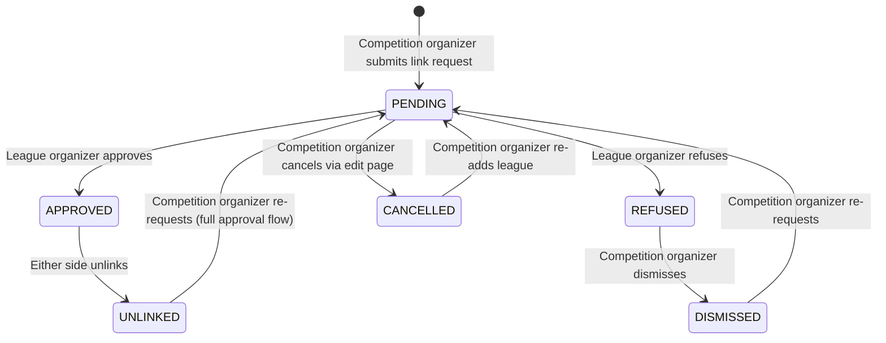

## Points System

- **Scoring strategy**: interchangeable code-level **plugin pattern** (e.g., F1-style, linear decrease, Olympic-style). Each strategy receives a participant's **full record data** (finish time, pieces completed, DNF/DNS status) and returns calculated points.
- **Granularity**: points stored at the **per-category** level. Total league points = sum of per-category points.
- **Automatic trigger**: points calculated when a category status → `COMPLETE`.
- **Manual trigger**: admin or league organizer can click **Recalculate Points**.
- **Strategy selection**: admin-only (on the management page). Changing strategy does **NOT** auto-recalculate — admin must trigger manually.
- **DNF/DNS**: **zero points**, participant still on leaderboard.
- **Ties**: **shared rank, skip next** (e.g., two 3rd places → no 4th).
- **Team/pair**: each member receives the same points individually.
- **Category restart**: old points **kept** until the category re-completes, then recalculated.
- **Points history**: only current totals stored. No historical audit log.

## Leaderboard

Displays participant rankings with: rank position (shared ranks for ties), name + avatar, total points, number of competitions participated in.

**Sorting options**: total points (default), number of competitions, average points per competition.

---

# 3. Roles & Permissions

## LEAGUE_ORGANIZER Role
A new role `LEAGUE_ORGANIZER` grants permission to create and manage leagues.

**How to get the role**: users request it through the same request/approval flow used for `ORGANIZER` (user applies → admin approves or rejects).

## Ownership & Co-management

| Capability | Owner | Co-manager |
|------------|:-----:|:----------:|
| Edit league details | Yes | Yes |
| Approve/refuse competition link requests | Yes | Yes |
| Unlink competitions | Yes | Yes |
| Add co-managers (searchable dropdown) | Yes | No |
| Remove co-managers | Yes | No |
| Approve/reject co-management requests | Yes | No |
| Archive / reactivate league | Yes | Yes |
| Recalculate points | Yes | Yes |
| Leave the league | No (always owner) | Yes |

- The **creator** of a league is its owner.
- Co-managers are added via a **searchable dropdown** filtered to `LEAGUE_ORGANIZER` users — added **immediately** (no acceptance step).
- Other `LEAGUE_ORGANIZER` users can **request** to co-manage; only the **owner** approves.
- **No ownership transfer** in v1.

---

# 4. Pages

## New Pages

### 4.1 Leagues Browse Page (`/leagues`)
- **Access**: public (anyone, including anonymous).
- **Content**: searchable list of leagues. **Active leagues shown by default**; filter/toggle to show archived.
- **Discovery**: also reachable via approved league chips on competition details pages.

### 4.2 League Details Page (`/leagues/[id]`)
- **Access**: public.
- **Content**:
  - Name, image/logo, description, rules, season dates
  - **Status badge** (active or archived)
  - **Competitions list** (upcoming / past)
  - **Leaderboard** with sorting options

### 4.3 Create/Edit League Page (`/leagues/edit/[[id]]`)
- **Access**: `LEAGUE_ORGANIZER` users only (403 otherwise). For editing: owner or co-managers only.
- **Pattern**: same form for create and edit (like `/competition/edit/[[id]]`).
- **Form fields**: name (required), description, rules, image/logo, start/end dates.
- **After creation**: redirects to league details page.
- **Archived leagues**: can still be edited.

### 4.4 League Management Page (`/leagues/[id]/manage`)
- **Access**: league owner, co-managers, and admins.
- **Sections/tabs**:
  - Pending competition link requests (approve/refuse with optional reason)
  - Currently linked competitions (with unlink action)
  - Co-managers (search to add, remove)
  - Inbound co-management requests (owner only — approve/reject with optional reason)
  - Archive/reactivate action
  - Manual points recalculation button
  - Admin-only: scoring strategy configuration

### 4.5 Co-management Request Page (`/leagues/[id]/request-management`)
- **Access**: `LEAGUE_ORGANIZER` users who are not already managing the league.
- **Content**: form to request co-management with a reason field.

### 4.6 My Leagues Page (`/leagues/my`)
- **Access**: authenticated users.
- **Sections**:
  - **Managed leagues** — leagues the user owns or co-manages (with links to management page).
  - **Participated leagues** — leagues the user has participated in (derived from competition participation).

## Existing Pages to Extend

| Page | Extension |
|------|-----------|
| **Permission request** (`/request_permissions`) | Add `LEAGUE_ORGANIZER` as a requestable role |
| **Admin review requests** (`/admin/review_requests`) | Allow admins to approve/reject `LEAGUE_ORGANIZER` requests |
| **Competition create/edit** | Add leagues selector: searchable dropdown (active leagues only), chips for approved/pending links, removal capability |
| **Competition details** | Show approved league chips publicly; show pending/refused with status badges to organizer only; allow organizer to dismiss refused links |

---

# 5. Workflows

## WF1: LEAGUE_ORGANIZER Role Request

### Steps
1. Authenticated user navigates to the **Permission Request page** (`/request_permissions`).
2. User selects `LEAGUE_ORGANIZER` from the role dropdown.
3. User fills in **reason** (required) and **additional info** (optional).
4. User submits the request.
5. An admin sees the pending request on the **Admin Review Requests page** (`/admin/review_requests`).
6. Admin **approves** or **rejects** the request.
7. User is notified of the decision.
8. If approved, user gains the `LEAGUE_ORGANIZER` role and can now create leagues.

### Unhappy paths
- User already has the `LEAGUE_ORGANIZER` role → role is not shown in the dropdown.
- User already has a pending request for `LEAGUE_ORGANIZER` → role is not selectable.
- Admin rejects → user is notified, role is not granted. User can request again.

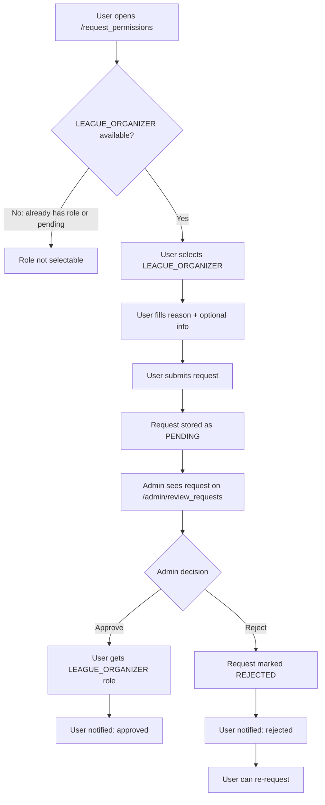

---

## WF2: League Creation

### Steps
1. User with `LEAGUE_ORGANIZER` role navigates to **Create League page** (`/leagues/edit`).
2. User fills in league details: name (required, globally unique), description, rules, image/logo, start/end dates.
3. User submits the form.
4. System validates: name uniqueness, required fields.
5. League is created with status `ACTIVE` and the creator as **owner**.
6. User is redirected to the **League details page** (`/leagues/[id]`).

### Unhappy paths
- Name already taken (by any league, active or archived) → validation error, form not submitted.
- Name is empty → client-side validation prevents submission.
- User without `LEAGUE_ORGANIZER` role tries to access `/leagues/edit` → 403.

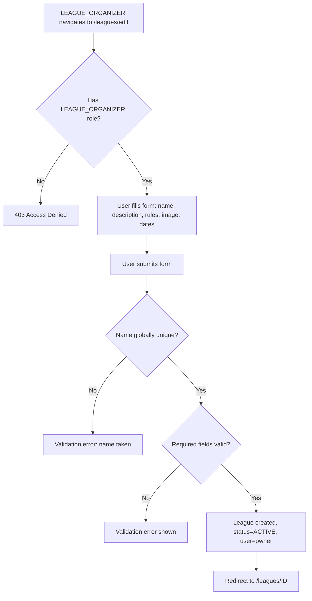

---

## WF3: League Editing

Uses the **same form as creation** (like competitions use `/competition/edit/[[id]]`).

### Steps
1. Owner or co-manager navigates to **Edit League page** (`/leagues/edit/[id]`).
2. Form is pre-populated with current league data.
3. User modifies fields.
4. User submits.
5. System validates (name uniqueness if changed, required fields).
6. League is updated.
7. User is redirected to the league details page.

### Unhappy paths
- Non-owner/non-co-manager tries to edit → 403.
- Changed name conflicts with another league → validation error.
- Editing an archived league → still allowed.

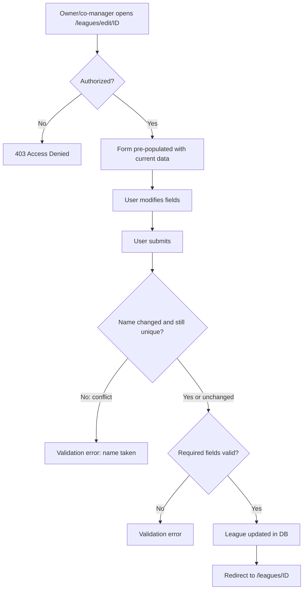

---

## WF4: Competition-League Linking

### Steps
1. Competition organizer opens the **competition create/edit page**.
2. In the "Leagues" section, a **searchable dropdown** shows only **active** leagues (archived excluded).
3. Organizer selects one or more leagues. Selected leagues appear as **chips** below the dropdown.
4. Leagues with an existing **PENDING** or **APPROVED** link are **not selectable**.
5. Organizer can remove a chip before submitting.
6. Organizer submits the form.
7. For each newly added chip → create `PENDING` link request.
8. For each removed PENDING chip → **cancel** the request.
9. For each removed APPROVED chip → **unlink** the competition (triggers points recalculation — see WF6).

### Edit page display rules
- **Approved** links: chips with remove "x" icon.
- **Pending** links: chips with pending badge + remove "x" icon.
- **Refused** links: **not shown** on the edit page.

### Competition details page display rules (organizer view)
- All league chips shown together with **status badges**:
  - Approved = no badge (or green checkmark)
  - Pending = yellow badge
  - Refused = red badge (with optional refusal reason on hover/click)
- Refused links are **persistent** until the organizer **dismisses** them.
- Non-organizers only see approved league chips (no status badges).
- Clicking any approved league chip navigates to the league's details page.

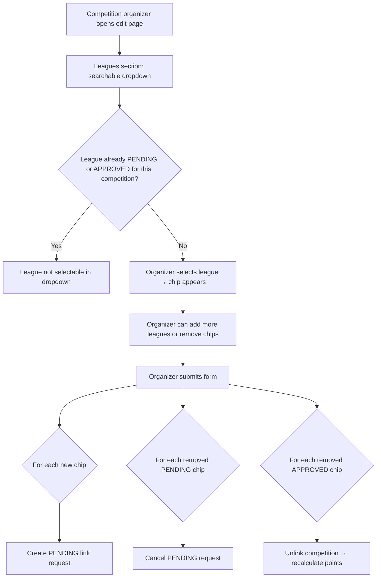

---

## WF5: Link Approval/Refusal

### Steps
1. League organizer (owner or co-manager) opens the **League Management page** (`/leagues/[id]/manage`).
2. In the "Pending Link Requests" section, they see all pending competition link requests.
3. Each request shows: competition name, organizer name, competition dates, and request date.
4. League organizer clicks **Approve** or **Refuse**.
5. If refusing, an **optional free-text reason** field is shown.
6. On approval: link status → `APPROVED`, competition visible on league details page. Points are **not** recalculated yet (happens when a category completes).
7. On refusal: link status → `REFUSED`, competition organizer sees the refused status with optional reason.

### Unhappy paths
- No pending requests → empty state shown.
- League is archived → no new pending requests can arrive (auto-refused on archive).

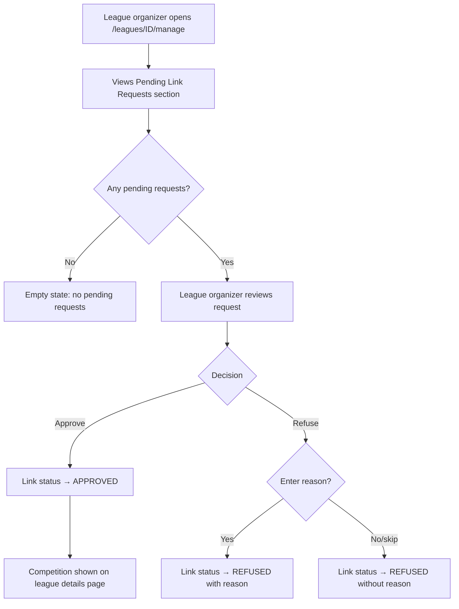

---

## WF6: Unlinking a Competition

### Competition organizer side
1. Organizer opens the **competition edit page**.
2. Removes an approved league chip.
3. Submits the form.
4. **Confirmation dialog** appears explaining the consequence (league points will be recalculated).
5. On confirm: link status → `UNLINKED`, league points recalculated without this competition's results.

### League organizer side
1. League organizer opens the **League Management page** (`/leagues/[id]/manage`).
2. In the "Linked Competitions" section, clicks **Unlink** next to a competition.
3. **Confirmation dialog** appears.
4. On confirm: link status → `UNLINKED`, league points recalculated.

### Re-linking
After unlinking, re-requesting goes through the **full approval flow** again (treated as a fresh request).

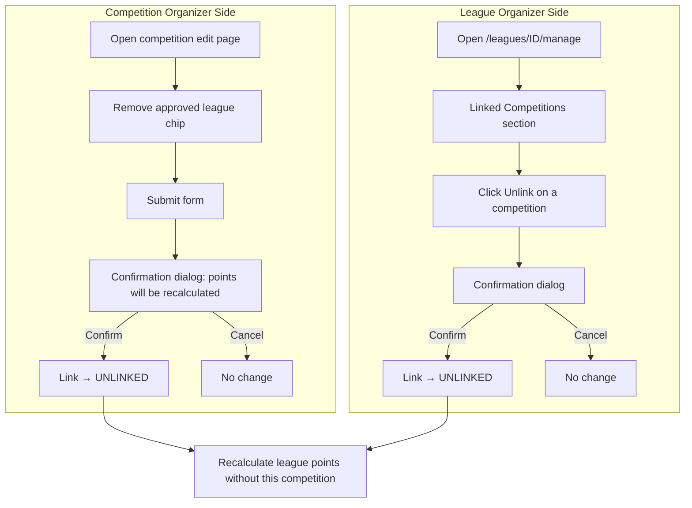

---

## WF7: Co-management — Owner Invitation

### Adding
1. League owner opens the **League Management page** (`/leagues/[id]/manage`).
2. In the "Co-managers" section, uses a **searchable user dropdown** (filtered to `LEAGUE_ORGANIZER` users only, excluding current managers).
3. Owner selects a user → user is **immediately** added as a co-manager (no acceptance step).

### Owner removing a co-manager
Owner clicks **Remove** next to a co-manager → removed immediately.

### Co-manager leaving
Co-manager clicks **Leave** / **Remove myself** → removed immediately.

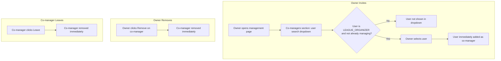

---

## WF8: Co-management — Inbound Request

### Steps
1. A `LEAGUE_ORGANIZER` user (not already managing the league) navigates to `/leagues/[id]/request-management`.
2. User fills in a **reason** for wanting to co-manage.
3. User submits → request stored as PENDING.
4. League **owner** (not co-managers) sees the pending request on the management page, in the "Co-management Requests" section.
5. Owner **approves** → user added as co-manager immediately.
6. Owner **rejects** (with optional reason) → request marked REJECTED.

### Unhappy paths
- User is already a co-manager → page shows "You are already managing this league".
- User is not a `LEAGUE_ORGANIZER` → 403.
- User already has a pending request → cannot submit another.

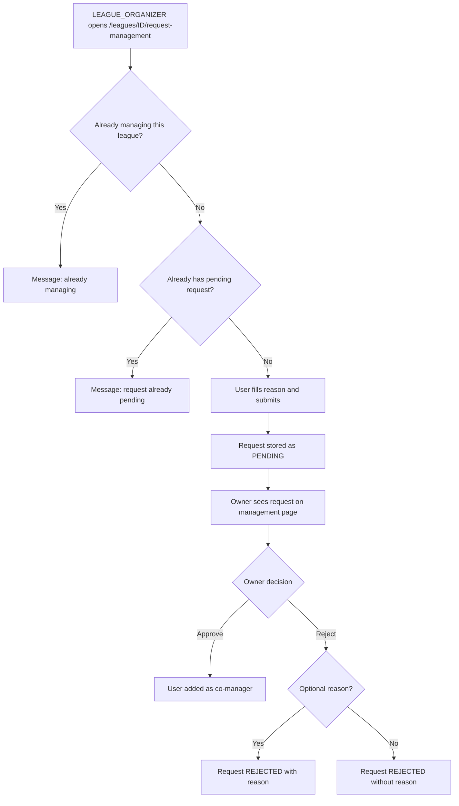

---

## WF9: Points Calculation

### Automatic trigger
1. A category of a linked competition transitions to `COMPLETE`.
2. System identifies all leagues with `APPROVED` links to that competition.
3. For each league: run the configured **scoring strategy plugin**.
4. Plugin receives **full record data** per participant (finish time, pieces completed, DNF/DNS status).
5. Points calculated per-category and stored.
6. DNF/DNS → **zero points**, still on leaderboard.
7. Leaderboard updated. Ties → **shared rank, skip next**.

### Manual trigger
Admin or league organizer clicks **Recalculate Points** on the management page → recalculates all points for all linked competitions using the current strategy.

### Scoring strategy change
Admin changes strategy → points are **NOT** auto-recalculated → admin must trigger manually.

### Category restart
Previously calculated points are **kept** until the category re-completes, then recalculated.

### Team/pair attribution
Each member receives the same points individually.

```mermaid
flowchart TD
    subgraph "Automatic Trigger"
        A1[Category status → COMPLETE] --> B1[Identify leagues linked to this competition]
        B1 --> C1{Any APPROVED links?}
        C1 -- No --> Z1[No action]
        C1 -- Yes --> D1[For each league: run scoring strategy plugin]
        D1 --> E1[Plugin receives full record data per participant]
        E1 --> F1[Calculate per-category points]
        F1 --> G1[Store points, update leaderboard]
        G1 --> H1[DNF/DNS → 0 points, still on leaderboard]
        H1 --> I1[Ties → shared rank, skip next]
    end

    subgraph "Manual Trigger"
        A2[Admin/league organizer clicks Recalculate] --> B2[Recalculate all points for all linked competitions]
        B2 --> C2[Use current scoring strategy]
        C2 --> D2[Update leaderboard]
    end

    subgraph "Strategy Change"
        A3[Admin changes scoring strategy] --> B3[No automatic recalculation]
        B3 --> C3[Admin must trigger manual recalculation]
    end
```

---

## WF10: League Archive & Reactivation

### Archive
1. Owner or co-manager opens the **League Management page**.
2. Clicks **Archive League**.
3. System checks: any linked competitions with unfinished categories (status ≠ COMPLETE and ≠ CANCELED)?
4. If yes → **blocked**: "Cannot archive while linked competitions have unfinished categories."
5. If no → **confirmation dialog**.
6. On confirm:
   - League status → `ARCHIVED`.
   - All **PENDING** link requests auto-refused (system reason: "League was archived").
   - All **PENDING** co-management requests auto-refused.
   - League remains visible but read-only. No new link requests accepted.

### Reactivation
1. Owner or co-manager opens the management page of an archived league.
2. Clicks **Reactivate League** → confirmation dialog.
3. On confirm: status → `ACTIVE`. League accepts new link requests again.

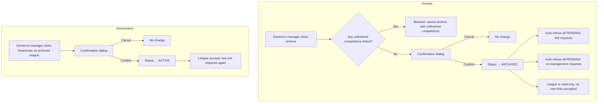

---

# 6. Test Plan

## WF1: LEAGUE_ORGANIZER Role Request (7 tests)

| ID | Test |
|----|------|
| T1.1 | User without `LEAGUE_ORGANIZER` role sees it in the permission request dropdown |
| T1.2 | User with an existing pending `LEAGUE_ORGANIZER` request does not see it in the dropdown |
| T1.3 | User who already has the `LEAGUE_ORGANIZER` role does not see it in the dropdown |
| T1.4 | Submitting a valid request creates a PENDING record visible to admins |
| T1.5 | Admin approving the request grants the `LEAGUE_ORGANIZER` role to the user |
| T1.6 | Admin rejecting the request does NOT grant the role; user can re-request |
| T1.7 | Non-admin users cannot access the review requests page |

## WF2: League Creation (8 tests)

| ID | Test |
|----|------|
| T2.1 | User without `LEAGUE_ORGANIZER` role cannot access `/leagues/edit` (gets 403) |
| T2.2 | Submitting a valid form creates a league with status=ACTIVE and correct owner |
| T2.3 | Duplicate league name (case-insensitive) is rejected with a validation error |
| T2.4 | Missing required name field prevents submission |
| T2.5 | Optional fields (description, rules, image, dates) can be left empty |
| T2.6 | After creation, user is redirected to `/leagues/[id]` |
| T2.7 | Newly created league appears on the leagues browse page |
| T2.8 | League name that matches an archived league's name is also rejected |

## WF3: League Editing (5 tests)

| ID | Test |
|----|------|
| T3.1 | Only owner and co-managers can access the edit page |
| T3.2 | Form is pre-populated with current league data |
| T3.3 | Changing the name to an existing name is rejected |
| T3.4 | Submitting without changes succeeds (no-op update) |
| T3.5 | Archived leagues can still be edited (details changed) |

## WF4: Competition-League Linking (11 tests)

| ID | Test |
|----|------|
| T4.1 | League search dropdown only shows active leagues (not archived) |
| T4.2 | Leagues with existing PENDING or APPROVED links are not selectable |
| T4.3 | Submitting the form creates PENDING link requests for newly added leagues |
| T4.4 | Removing a pending chip and submitting cancels the pending request |
| T4.5 | Removing an approved chip and submitting unlinks the competition (with points recalculation) |
| T4.6 | Competition details page shows approved chips to all users |
| T4.7 | Competition details page shows pending/refused badges only to the organizer |
| T4.8 | Refused link with a reason shows the reason on hover/click |
| T4.9 | Organizer can dismiss a refused link from the details page |
| T4.10 | After dismissing a refused link, the organizer can re-request the same league |
| T4.11 | Non-organizer users do not see pending or refused badges |

## WF5: Link Approval/Refusal (8 tests)

| ID | Test |
|----|------|
| T5.1 | Only league owner and co-managers can access the management page |
| T5.2 | Pending link requests are listed with correct competition details |
| T5.3 | Approving a request changes status to APPROVED |
| T5.4 | After approval, competition appears on the league details page |
| T5.5 | Refusing a request changes status to REFUSED |
| T5.6 | Refusal reason (when provided) is visible to the competition organizer |
| T5.7 | Empty state shown when no pending requests exist |
| T5.8 | Admins can also access the management page and perform approvals |

## WF6: Unlinking a Competition (8 tests)

| ID | Test |
|----|------|
| T6.1 | Competition organizer can unlink an approved league from the edit page |
| T6.2 | Confirmation dialog is shown before unlinking |
| T6.3 | After unlinking, league points are recalculated without the unlinked competition's results |
| T6.4 | League organizer can unlink from the management page |
| T6.5 | After unlinking, the competition no longer appears on the league details page |
| T6.6 | After unlinking, the competition organizer can re-request linking (full approval flow) |
| T6.7 | Participants who only participated via the unlinked competition are removed from the league leaderboard |
| T6.8 | Cancelling the confirmation dialog does not unlink |

## WF7: Co-management — Owner Invitation (9 tests)

| ID | Test |
|----|------|
| T7.1 | Owner can search and add `LEAGUE_ORGANIZER` users as co-managers |
| T7.2 | Non-`LEAGUE_ORGANIZER` users do not appear in the search |
| T7.3 | Users who are already managing the league do not appear in the search |
| T7.4 | Added co-manager immediately has access to the management page |
| T7.5 | Owner can remove a co-manager |
| T7.6 | Removed co-manager loses access to the management page immediately |
| T7.7 | Co-manager can leave voluntarily |
| T7.8 | Co-managers cannot remove other co-managers (only the owner can) |
| T7.9 | The owner cannot be removed or leave (they are always the owner) |

## WF8: Co-management — Inbound Request (8 tests)

| ID | Test |
|----|------|
| T8.1 | Only `LEAGUE_ORGANIZER` users can access the request page |
| T8.2 | Users already managing the league see a "you are already managing" message |
| T8.3 | Users with a pending request cannot submit another |
| T8.4 | Valid submission creates a PENDING request visible to the owner |
| T8.5 | Only the owner (not co-managers) can approve/reject co-management requests |
| T8.6 | Approving adds the user as co-manager with full management access |
| T8.7 | Rejecting with a reason stores the reason |
| T8.8 | Rejected user can submit a new request |

## WF9: Points Calculation (13 tests)

| ID | Test |
|----|------|
| T9.1 | When a category completes, points are calculated for all linked leagues |
| T9.2 | Points are stored at the per-category level |
| T9.3 | Total league points = sum of per-category points |
| T9.4 | DNF/DNS participants get zero points but appear on the leaderboard |
| T9.5 | Tied participants share the same rank; next rank(s) are skipped |
| T9.6 | Manual recalculation button works and updates all points |
| T9.7 | Changing scoring strategy does NOT auto-recalculate |
| T9.8 | After strategy change + manual recalculation, points reflect the new strategy |
| T9.9 | Category restart does not wipe previously calculated points |
| T9.10 | When a restarted category re-completes, its points are recalculated |
| T9.11 | Team/pair members each receive the same points individually |
| T9.12 | Unlinking a competition triggers recalculation that removes that competition's points |
| T9.13 | Categories from competitions without APPROVED links do not generate points |

## WF10: League Archive & Reactivation (10 tests)

| ID | Test |
|----|------|
| T10.1 | Archiving is blocked when linked competitions have unfinished categories |
| T10.2 | Archiving sets status to ARCHIVED |
| T10.3 | All pending link requests are auto-refused on archive |
| T10.4 | All pending co-management requests are auto-refused on archive |
| T10.5 | Archived leagues cannot accept new link requests |
| T10.6 | Archived leagues still appear on browse page when "show archived" filter is active |
| T10.7 | Archived leagues can be reactivated |
| T10.8 | After reactivation, league accepts new link requests again |
| T10.9 | Archived leagues can still be edited (details updated) |
| T10.10 | Confirmation dialog is shown before archiving and reactivating |

---

# 7. Refinements Log

All decisions captured from the workflow clarification sessions:

## League Creation
- Name is **globally unique** (across active and archived leagues).
- Editing uses the **same form as creation** (like competitions).
- After creation, user is redirected to the **league details page**.

## Competition-League Linking
- Only **active** leagues shown in the search dropdown (archived excluded).
- **Blocked** from re-requesting while PENDING or APPROVED.
- After REFUSED: link request **not shown** on edit page, shown on details page with red badge.
- Refused links are **persistent** on the details page until dismissed by the organizer.
- On the edit page: approved and pending chips shown (refused hidden).
- Removing an approved chip from edit page triggers **unlink** on form submit.
- Removing a pending chip from edit page **cancels** the request on form submit.
- All chips shown together on details page with **status badges** (organizer-only view).

## Unlinking
- **Confirmation dialog** before unlinking (explains points recalculation consequence).
- League-side unlink: from management page, linked competitions section.
- After unlink, **re-linking goes through full approval flow** again.

## Co-management
- Owner adds co-managers via **searchable dropdown** (filtered to LEAGUE_ORGANIZER).
- Added **immediately** (no acceptance step).
- Owner can **remove** co-managers; co-managers can **leave** voluntarily.
- Only the **owner** approves inbound co-management requests (not co-managers).
- **Optional reason** when rejecting co-management requests.
- **No ownership transfer** in v1.

## Points
- Scoring plugins receive **full record data** (time, pieces, DNF/DNS).
- DNF/DNS: **zero points**, still on leaderboard.
- Ties: **shared rank, skip next**.
- Strategy change: recalculation on **admin trigger** only (not automatic).
- Category restart: old points **kept** until re-complete.

## League Lifecycle
- Archive is **reversible** (can be reactivated).
- Pending link requests **auto-refused** on archive.
- Pending co-management requests **auto-refused** on archive.
- Archiving **blocked** while linked competitions have unfinished categories.
- Browse page: **active by default**, filter for archived.
- My leagues page: shows **managed + participated** leagues.

