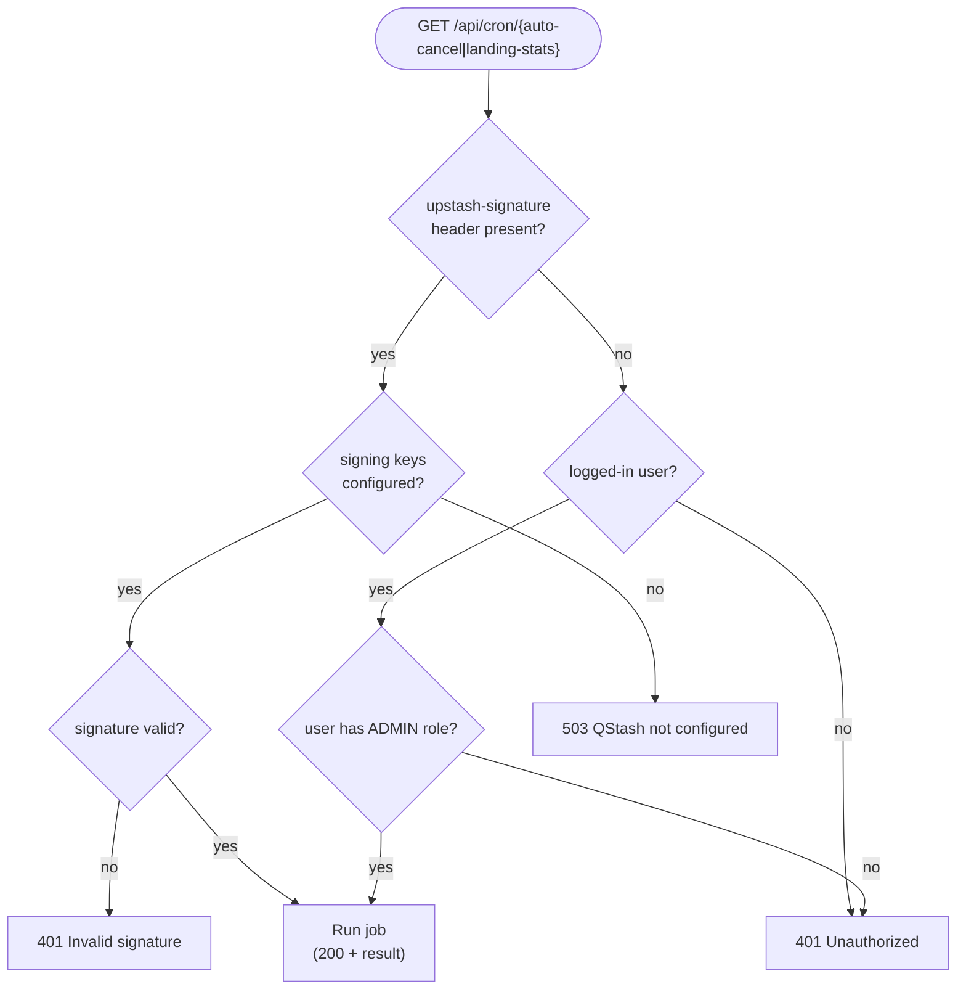
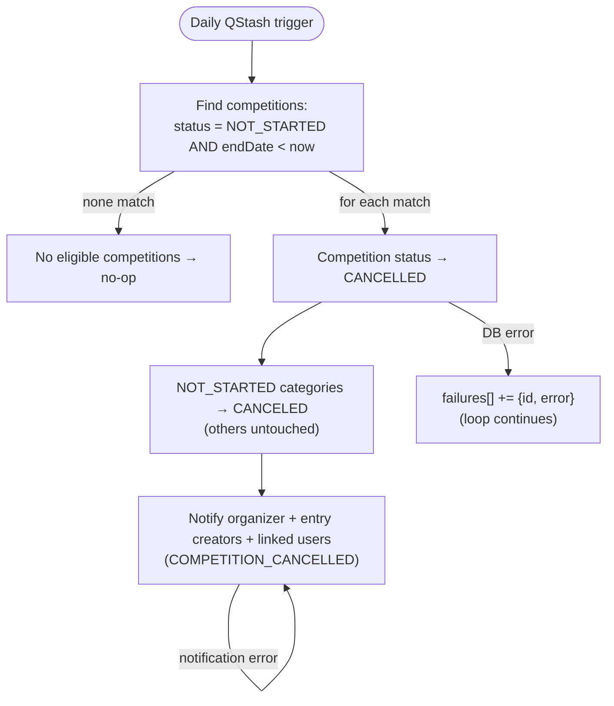

# QStash-driven scheduled cron jobs

This document describes how the two scheduled cron jobs behave today, as implemented in the
source code. Where earlier intent or comments disagree with the code, the **code wins** and the
difference is called out as a caveat.

## Purpose

Two recurring server jobs keep the platform consistent without manual intervention:

- **auto-cancel** — daily, cancels competitions that are still `NOT_STARTED` after their
  `endDate` has passed, plus their not-started categories, and notifies everyone involved.
- **landing-stats** — weekly, recomputes the public landing-page counters (upcoming
  competitions, distinct cities, participant count).

Both endpoints are triggered by **Upstash QStash recurring schedules**, not by Vercel native
crons. This was the central change: Vercel only runs `vercel.json` crons on **Production**
deployments, so the jobs never fired in the preview-based `test` environment. QStash is an
external scheduler that calls a public URL, so one set of schedules can drive **both production
and preview** environments. Each endpoint authenticates the QStash request by **verifying its
signature** (with an authenticated admin session as a manual fallback).

## Source files inspected

**Cron endpoints** (`src/routes/(internal)/api/cron/`)
- `auto-cancel/+server.ts` — `GET` handler: QStash-signature/admin auth, query parsing, delegates
  to the auto-cancel service.
- `auto-cancel/auto-cancel.test.ts` — unit tests for the handler's auth + delegation.
- `landing-stats/+server.ts` — `GET` handler: same auth model, recomputes and upserts landing
  stats.

**Services / data**
- `src/lib/services/auto-cancel.ts` — `autoCancelExpiredCompetitions({ dryRun, competitionId })`
  and `collectRecipients`.
- `src/lib/database/db_competition.ts` — `upsertLandingStats`.
- `src/lib/notifications/notifications.ts` — `createNotificationForUsers`.

**Security pipeline**
- `src/lib/api_utils/api_whitelist.ts` — `/api/cron/` is a public API prefix, so the global
  `/api/` pipeline (CSRF, session, rate-limit, route-guard) is skipped; each cron endpoint does
  its own auth.
- `src/hooks.server.ts` — the API security pipeline that the whitelist bypasses.

**Shared QStash pattern (reference)**
- `src/lib/services/auto-stop-singleton.ts`, `auto-stop-scheduler.ts`,
  `src/routes/(internal)/api/webhooks/qstash/auto-stop/+server.ts` — the existing `Receiver`
  signature-verification pattern the cron endpoints now mirror.

**Admin trigger (UI)**
- `src/lib/components/common/layout/DrawerNav.svelte` — admin-only "Auto-cancel (dry run)" button
  that calls `GET /api/cron/auto-cancel?dryRun=true` via the admin-session path.

**Deployment**
- `vercel.json` — **deleted**. It previously declared the native crons; no native Vercel crons
  remain.

## Domain terms and stored states

- **CompetitionStatus** — `auto-cancel` targets `NOT_STARTED` competitions and transitions them to
  `CANCELLED`.
- **CategoryStatus** — only `NOT_STARTED` categories of a cancelled competition transition to
  `CANCELED`. Categories in any other state are left untouched.
- **LandingStats** — persisted counters upserted by `landing-stats` (upcoming count, city count,
  participant count).
- **Recipients** — for an auto-cancelled competition: the competition `creatorId` (organizer),
  every entry `creatorId`, and every platform `user` linked to an entry, de-duplicated into a
  set.

## Authentication model (both endpoints)

Each endpoint is a `GET` and accepts **either**:

1. **A valid QStash signature** — the request carries an `upstash-signature` header, verified with
   a `Receiver` built from `QSTASH_CURRENT_SIGNING_KEY` / `QSTASH_NEXT_SIGNING_KEY`. This is how
   the scheduled jobs authenticate.
2. **An authenticated admin session** — no signature header, but `event.locals.user` has an
   `ADMIN` `RoleAssignment`. This is how the admin dry-run button (and any manual browser call)
   authenticates.

The previous `Authorization: Bearer <CRON_SECRET>` path was **removed**.

### Auth decision tree

## Trigger architecture

- **Scheduler:** Upstash QStash recurring **Schedules**, created out-of-band (dashboard/API), not
  declared in the repo. Each schedule POSTs to
  `https://qstash.upstash.io/v2/schedules/<destination-url>` with `Upstash-Cron` and
  `Upstash-Method: GET`; QStash then calls the destination and signs the request.
- **Targets:** one schedule per (job × environment) — **4 total**: auto-cancel and landing-stats,
  each against the production domain and the `test` preview branch-alias URL.
- **Cadence:** auto-cancel `0 0 * * *` (daily); landing-stats `0 0 * * 1` (weekly). These mirror
  the cadences the deleted `vercel.json` used.
- **Signing keys** are account-level and identical across environments, so the same signature
  verifies in prod and preview.
- **Preview reachability:** if Vercel Deployment Protection is ON for previews, the test schedule
  must forward a `x-vercel-protection-bypass` header; if protection is OFF, no bypass is needed.

## Job behavior

### auto-cancel (`autoCancelExpiredCompetitions`)

1. **Select** competitions where `status = NOT_STARTED` **and** `endDate < now` (optionally
   filtered to a single `competitionId`).
2. **Dry run** (`dryRun=true`): compute counts only — how many `NOT_STARTED` categories would
   change and how many recipients would be notified — and return without mutating.
3. **Real run**, per competition:
   - Update competition `status → CANCELLED`.
   - Update its `NOT_STARTED` categories `status → CANCELED` (other category states untouched).
   - Collect + de-duplicate recipients and send a `COMPETITION_CANCELLED` notification
     (`notifications.titles/messages.competition_auto_cancelled`, deep-linked to the competition).
   - A per-competition failure is captured in `failures[]` and counted in `failed`; it does not
     stop the loop. A notification failure increments `notificationFailures` but does **not** roll
     back the cancellation.
4. **Return** an `AutoCancelResult` with counts: `eligible`, `eligibleCompetitionIds`,
   `cancelled`, `skipped`, `failed`, `categoriesChanged`, `recipientsAttempted`,
   `notificationFailures`, `failures`.

### landing-stats

1. Count competitions with `status IN (NOT_STARTED, STARTED)` → **upcoming count**.
2. `groupBy location` over the same statuses where `location` is not null; the number of groups →
   **city count**.
3. Count users that have at least one entry → **participant count**.
4. `upsertLandingStats({ upcomingCount, cityCount, participantCount })` and return
   `{ success: true, stats }`.

## Side effects

- **DB writes (auto-cancel):** competition status, category statuses, and notification rows.
- **DB writes (landing-stats):** the upserted landing-stats record.
- **Notifications:** `COMPETITION_CANCELLED` to all collected recipients per cancelled
  competition.
- **Logging:** both services/handlers log progress and errors under `[auto-cancel]` /
  `[landing-stats]` prefixes.
- **Idempotency:** re-running auto-cancel is safe — already-`CANCELLED` competitions no longer
  match `status = NOT_STARTED`, so a second pass finds nothing to do.

## Local testing (preview-equivalent)

QStash must reach a public URL, so the dev server is exposed via ngrok. See
[[local-qstash-cron-testing]] (memory) for the full recipe; in short:

- `ngrok http 5173 --host-header=rewrite` — the `--host-header=rewrite` is required because Vite
  rejects the ngrok host otherwise; rewriting the Host is safe since signature verification does
  **not** check the URL/host.
- An **unsigned** request through the tunnel returns the app's `401 {"error":"Unauthorized"}`,
  confirming reachability and active signature verification.
- A QStash one-off **publish** with `?dryRun=true` exercises the signed round-trip without
  mutating data.

## Edge cases and caveats

- **Enum spelling differs between the two statuses** — competitions become
  `CompetitionStatus.CANCELLED` (two L's) while categories become `CategoryStatus.CANCELED` (one
  L). This is intentional in the code/schema; don't "fix" one to match the other.
- **No URL/host check in signature verification** — `receiver.verify({ signature, body })` omits
  the `url` claim (matching the auto-stop webhook). This is what allows the ngrok host rewrite to
  work, but it means a signature is not bound to a specific destination URL.
- **Schedules live outside the repo** — the 4 QStash schedules are created via the QStash
  dashboard/API and are not version-controlled. There is no in-repo source of truth for the
  cadence/targets beyond this document.
- **`landing-stats` still uses `CRON_SECRET`? No.** Both endpoints were migrated; `CRON_SECRET`
  is no longer referenced in code. The env var may still exist in deployments and can be removed
  once schedules are confirmed live.
- **`503` vs `401` for QStash requests** — a signed request to an environment missing the signing
  keys returns `503 QStash not configured` (not `401`), which distinguishes a misconfigured
  environment from a bad signature.
- **Admin dry-run button** — `DrawerNav.svelte` only calls auto-cancel with `dryRun=true`; there
  is no UI for a real run or for landing-stats. Real runs happen only via the QStash schedules.
- **`vercel.json` is gone** — if any future Vercel-specific config is needed, the file must be
  recreated; do not re-add a `crons` block (it would double-trigger production alongside QStash).
