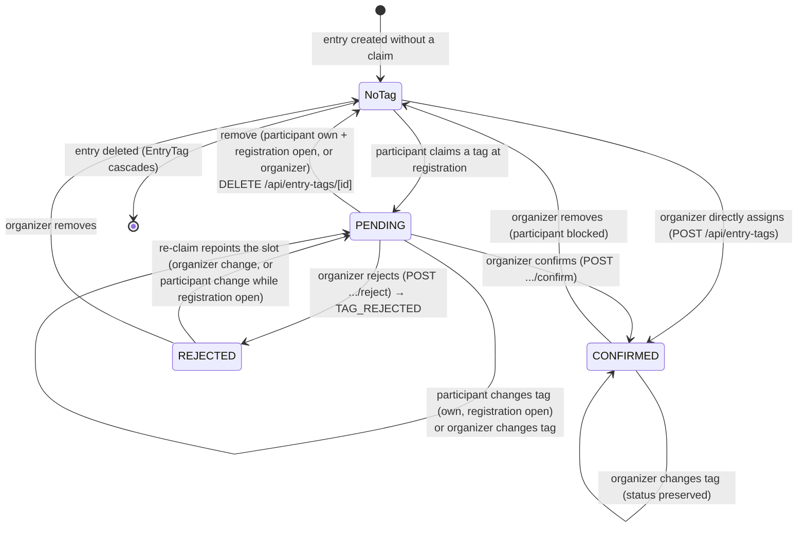
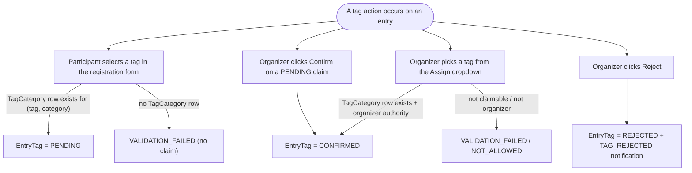

# Entry Tags / Participant Sub-Prize Tags

This document describes how the **sub-prize tag** feature behaves today, as implemented in the
source code. It is intended as the canonical reference for writing e2e tests. Where the plans /
handoff documents disagree with the code, the **code wins** and the difference is called out as a
caveat.

## Purpose

Organizers segment entries into **sub-prize groups** within a category (e.g. "Local municipality",
"Juvenile") **without removing them from the general ranking**. A registrant claims a tag for the
whole entry at registration; the organizer confirms or rejects it; confirmed tags appear as badges
plus a filter-only toggle on the public results page and can carry an optional flat price override.

A tag is an **entry-level qualification**, not a per-person attribute. Age and locality are **not**
computed or stored — the organizer judges eligibility by eye. This is why the tag attaches to the
`Entry`, sidestepping the fact that minors usually register as `ExternalParticipant`s with no
account.

## Source files inspected

**Schema / migrations**
- `prisma/schema.prisma` — enums `ParticipantTagType`, `EntryTagStatus`; models `TagCategory`,
  `EntryTag`; `NotificationType.TAG_REJECTED`; back-relations `Category.tagCategories`,
  `Entry.entryTag`.
- `prisma/migrations/20260606140010_entry_tag_addition/`,
  `prisma/migrations/20260606145556_tag_categories_2/`.

**Database layer**
- `src/lib/database/db_participant_tags.ts` — `getAvailableTagsByCategory`,
  `isTagClaimableInCategory`, `isParticipantTagType`, `PARTICIPANT_TAG_TYPES`.
- `src/lib/database/db_competition.ts` — `getCompetitionResults` (surfaces `confirmedTag` +
  per-category `availableTags`).
- `src/lib/database/db_entry.ts` — `getRegistrationsForCompetition` (includes each entry's
  `entryTag` and each category's `tagCategories`).

**Services**
- `src/lib/services/entry-tags.ts` — `confirmEntryTag`, `rejectEntryTag`, `assignEntryTag`,
  `changeEntryTag`, `removeEntryTag` (authority + lifecycle rules).
- `src/lib/services/registration-workflow.ts` — `CategorySignup.claimedTag`, creates the `PENDING`
  `EntryTag` inside `submitRegistration`.

**API endpoints** (`src/routes/(internal)/api/entry-tags/`)
- `+server.ts` — `POST` assign.
- `[id]/+server.ts` — `PATCH` change, `DELETE` remove.
- `[id]/confirm/+server.ts` — `POST` confirm.
- `[id]/reject/+server.ts` — `POST` reject.

**Notifications**
- `src/lib/notifications/tag_notifications.ts` — `notifyTagRejected`.

**UI — competition create/edit**
- `src/lib/components/competition_edit/CategoryTagSelector.svelte`.
- `.../competition/edit/[[id=integer]]/+page.svelte` and `+page.server.ts`.
- `.../competition/edit/services/competition-form.ts` — `CategorySchema.tagCategories`,
  `transformTagCategories`.

**UI — registration**
- `.../competition_details/[id=integer]/registration/+page.svelte` and `+page.server.ts`.

**UI — registration management**
- `src/lib/components/manage_registrations/RegistrationRow.svelte`,
  `RegistrationList.svelte`.
- `.../competition/[id=integer]/manage_registrations/+page.svelte` and `+page.server.ts`.

**UI — results**
- `.../competition_details/[id=integer]/results/+page.svelte`.
- `src/app.d.ts` — `ResultEntry.confirmedTag`, `ResultCategory.availableTags`.

**i18n**
- `src/lib/translations/{en,es,ca}/common.json` — `participant_tags.*`, `competition.create.tags_*`,
  `registration.tag_*`, `manage_registrations.tag_*`, `results.filter_by_tag`/`tag_filter_all`,
  `notifications.{titles,messages}.tag_rejected`.

## Domain terms and stored states

- **Participant Tag** — a value of the fixed enum `ParticipantTagType`. Today: `LOCAL_MUNICIPALITY`,
  `JUVENILE`. Display names are translated via `participant_tags.<TAG>`. There is **no** organizer-created
  tag record and **no** free-text names.
- **Tag Category** (`TagCategory`) — the organizer's availability/pricing row. A tag is **claimable
  in a category if and only if** a `TagCategory(tag, categoryId)` row exists. `priceOverride Int?`:
  `null` = prize-only label; non-null = overrides `Category.price`. `@@unique([tag, categoryId])`.
- **Entry Tag** (`EntryTag`) — the single mutable claim slot on an entry. `@@unique([entryId])` →
  at most **one tag per entry**. Holds `tag` and `status`.

### `EntryTag.status` (`EntryTagStatus`)

| Status | Meaning | Public badge? | Drives price? |
|---|---|---|---|
| `PENDING` | Claimed at registration, awaiting organizer review | No | Yes (override applies immediately) |
| `CONFIRMED` | Organizer accepted (or directly assigned) | Yes | Yes |
| `REJECTED` | Organizer rejected the claim | No | No (reverts to base price) |

> **Naming collision:** `EntryTag.status === CONFIRMED` is independent of the entry's
> `RegistrationStatus.CONFIRMED`. A public sub-prize badge only depends on the **tag** status.

### Relations & cascades

- `Category 1—* TagCategory`, `onDelete: Cascade` — deleting a category removes its availability rows.
- `Entry 1—1 EntryTag` (via `@@unique([entryId])`), `onDelete: Cascade` — deleting an entry removes
  its claim.
- **No FK between `EntryTag` and `TagCategory`** (both reference the enum). Removing a category's
  availability does **not** delete existing claims; such a claim simply loses its price override.

## Settings / flags that affect the workflow

- **A `TagCategory` row exists for `(tag, categoryId)`** — the master switch. Without it the tag is
  not offered at registration, cannot be assigned by the organizer (server rejects with
  `VALIDATION_FAILED`), and does not appear as a results filter for that category.
- **`Competition.registrationOpen`** — gates participant-side edits to a `PENDING` claim. Organizers
  are not gated by it for tag actions.
- **`Competition.showPaymentWarning`** — when off (or `Category.price === 0`), registration is "free";
  affects the payment-warning UI but not tag mechanics. The off-platform reconciliation note only
  shows inside the payment-warning popover.
- **Category type gate (UI)** — the `CategoryTagSelector` only renders once a category type is chosen
  (it sits at the bottom of the type-gated category detail grid in the edit form).

## Authority model

Resolved by `getCompetitionAccess(competitionId, userId).canManageCompetition`
(`src/lib/services/entry-tags.ts`). An **organizer** = competition creator, scoped competition
co-organizer, or global ADMIN.

| Action | Organizer | Entry creator (participant) |
|---|---|---|
| Claim a tag (at registration) | n/a (claims happen via the registration form) | Yes, while registration open |
| Confirm a `PENDING` claim | Yes | No |
| Reject a claim | Yes | No |
| Directly assign a tag (→ `CONFIRMED`) | Yes | No |
| Change the tag on the slot | Yes, any time (status preserved) | Only own claim, only while `PENDING` **and** registration open (resets to `PENDING`) |
| Remove the claim | Yes, any time | Only own claim, only while `PENDING` **and** registration open |

A `PENDING` claim is owned by the participant; a `CONFIRMED` claim is locked to the participant and
only an organizer can change/remove it.

## Workflows

### 1. Organizer configures availability (create or edit competition)

`CategoryTagSelector.svelte` renders each enum tag as a checkbox with an optional price-override input
shown only when checked. It is embedded in **both** the `create[]` and `update[]` category cards, so
tags can be configured **during initial creation** and during edits in the **same single submit** that
writes the competition and its categories.

- The enum list is passed via `data.props.participantTags` (= `PARTICIPANT_TAG_TYPES`).
- Selections live on each category object's `tagCategories: { tag, priceOverride|null }[]` array
  (client-side, bound via `$bindable`). Re-adding a removed category yields a fresh, empty selector.
- On submit, `CategorySchema.tagCategories` (Zod) validates `priceOverride >= 0` when present.
- `transformTagCategories` maps the array into Prisma nested writes inside the existing competition
  transaction:
  - **new category** → `tagCategories: { create: [...] }`
  - **updated category** → `tagCategories: { deleteMany: {}, create: [...] }` (full replace)
- `deleteMany`-then-`create` replaces availability and, **by design, does not touch existing
  `EntryTag` claims** (no FK between them).

> **Caveat (supersedes the 2026-06-06 handoff):** the earlier two-phase "Sub-prize tags" panel
> (`ParticipantTagsManager.svelte`), the `/api/tag-categories` endpoint, and `setTagAvailability`
> have been **removed**. Availability is now configured inline per-category. Any test or doc
> referencing those paths is stale.

### 2. Participant claims a tag at registration

`registration/+page.server.ts` loads `availableTagsByCategory` (via `getAvailableTagsByCategory`).
In `registration/+page.svelte`, each category slot whose category has ≥1 available tag shows a
**single-select** dropdown (`registration.tag_label`, default option `registration.tag_none`). Each
option shows the translated tag name and, if priced, ` — {priceOverride}€`.

- The selected tag is carried on the slot as `claimedTag` and sent inside the `signups` payload as
  `CategorySignup.claimedTag`.
- On submit, `submitRegistration` creates the entry, then if `claimedTag` is set it re-validates a
  `TagCategory` row exists for `(claimedTag, categoryId)` (else `VALIDATION_FAILED`) and creates an
  `EntryTag` with status **`PENDING`**.
- Pricing (client-side display only — the app never processes money):
  - **Effective slot price** = the claimed tag's `priceOverride` if non-null, else `Category.price`.
    A `PENDING` claim therefore drives the displayed/charged price immediately.
  - When any queued slot claims a **priced** tag, the payment-warning popover shows
    `registration.tag_price_reconcile_warning` (reject → revert to base price, difference reconciled
    off-platform).
- Tag claims are **independent of registration status**: a `WAITLISTED` entry keeps its claim; the
  override applies if/when it is promoted (the fee breakdown only charges reserved slots).

### 3. Organizer reviews claims (registration management)

`manage_registrations/+page.server.ts` loads via `getRegistrationsForCompetition`, which includes each
entry's `entryTag` (`{ id, status, tag }`) and each category's `tagCategories` (`{ tag }`). The page
passes `availableTags = category.tagCategories.map(tc => tc.tag)` (a `string[]`) down through
`RegistrationList` → `RegistrationRow`. The tag controls render for entries in **every** status group
(pending / waitlisted / confirmed registrations).

In `RegistrationRow.svelte`:
- **If the entry has a claim**, a badge shows the tag plus a status suffix (`· Pending` /
  `· Rejected`; confirmed shows no suffix), colored by status (success / error-tonal / warning-tonal).
  - `PENDING` → **Confirm** (✓) and **Reject** (✗) buttons → `POST /api/entry-tags/[id]/confirm` /
    `.../reject`.
  - Any status → **Remove** (trash) → `DELETE /api/entry-tags/[id]`.
- **If the entry has no claim** but the category has available tags, an **Assign** dropdown
  (`manage_registrations.tag_assign_placeholder`) → `POST /api/entry-tags` with `{ entryId, tag }`,
  creating the claim directly as **`CONFIRMED`**.
- All requests run through `runTagRequest`, which calls `invalidateAll()` on success to refresh.

### 4. Public results — badges and filter

`getCompetitionResults` (`db_competition.ts`) includes each entry's `entryTag` (filtered to
`status = CONFIRMED` via `EntryTagStatus.CONFIRMED`) and maps it to `confirmedTag: string | null`
(`PENDING`/`REJECTED` are stripped). Each category exposes `availableTags: string[]` =
the deduped set of its `tagCategories` tags.

In `results/+page.svelte`:
- Every entry with a `confirmedTag` shows an **always-visible** badge (`preset-tonal-primary`),
  rendered in both the table and card layouts.
- A **per-category filter** (`results.filter_by_tag`, with an "All" reset = `results.tag_filter_all`)
  appears when `availableTags.length > 0`. Selecting a tag narrows the displayed ranking to entries
  whose `confirmedTag` matches, **preserving the finish-time / piece-count order** (filter-only, no
  re-scoring). The sub-prize winner is simply the top remaining entry. The filter resets when the
  selected category changes.

### 5. Notifications

Only **rejection** notifies. `rejectEntryTag` calls `notifyTagRejected`, creating a
`NotificationType.TAG_REJECTED` notification to the entry creator
(`notifications.titles.tag_rejected` / `notifications.messages.tag_rejected`, linking to the
competition details page). Confirmation and direct assignment are **not** notified (self-evident via
badge + applied price).

## State machine

Notes on the diagram:
- `NoTag` = the entry has no `EntryTag` row (the `@@unique([entryId])` slot is empty).
- "change tag" = `changeEntryTag` (`PATCH /api/entry-tags/[id]`). For a participant it always lands in
  `PENDING`; for an organizer it preserves the current status.
- Direct assign (`assignEntryTag`) is an `upsert`: if a slot already exists it is **repointed** to the
  new tag and set to `CONFIRMED`.

## Decision tree — what status does a claim get?

## Side effects

- **DB writes:** `EntryTag` create (claim/assign), update (confirm/reject/change), delete (remove);
  `TagCategory` create / `deleteMany`+create on competition save.
- **Timestamps:** `EntryTag.createdAt` / `updatedAt` (Prisma-managed).
- **Notification:** `TAG_REJECTED` to the entry creator on reject only.
- **Cache invalidation:** management UI calls `invalidateAll()` after each tag mutation;
  registration load uses `event.depends('data:registration')`.
- **Pricing:** no money is moved; price changes are display-only and reconciled off-platform.

## API reference

| Method | Path | Service | Effect | Auth |
|---|---|---|---|---|
| `POST` | `/api/entry-tags` | `assignEntryTag` | Upsert claim → `CONFIRMED` | organizer |
| `POST` | `/api/entry-tags/[id]/confirm` | `confirmEntryTag` | `PENDING` → `CONFIRMED` (idempotent) | organizer |
| `POST` | `/api/entry-tags/[id]/reject` | `rejectEntryTag` | → `REJECTED` + notify | organizer |
| `PATCH` | `/api/entry-tags/[id]` | `changeEntryTag` | Repoint slot to a new tag | organizer any time; creator only while `PENDING` + reg. open (→ `PENDING`) |
| `DELETE` | `/api/entry-tags/[id]` | `removeEntryTag` | Delete the claim | organizer any time; creator only while `PENDING` + reg. open |

Error codes (`EntryTagError`): `NOT_FOUND` → 404, `NOT_ALLOWED` → 403, others
(`REGISTRATION_CLOSED`, `INVALID_STATUS`, `VALIDATION_FAILED`) → 400. All endpoints require an
authenticated user (401 otherwise).

## Edge cases and caveats

- **Confirm/reject use `POST`, not `PATCH`.** The plan and the 2026-06-06 handoff describe
  `PATCH .../confirm` and `PATCH .../reject`; the implemented endpoints are **`POST`**
  (`[id]/confirm/+server.ts`, `[id]/reject/+server.ts`). Tests must use `POST`.
- **No participant-facing post-submit tag UI.** A participant can only claim a tag during the
  registration form submit. The `changeEntryTag` (`PATCH`) and participant-side `removeEntryTag`
  capabilities exist server-side and enforce the "own + `PENDING` + registration open" rules, but **no
  UI currently calls the `PATCH` change endpoint** (the only UI callers are organizer confirm / reject
  / remove / assign in `RegistrationRow`). Participant-side change/remove are reachable only by calling
  the API directly.
- **`assignEntryTag` is an upsert.** Assigning to an entry that already has a claim repoints it to the
  new tag as `CONFIRMED`. In the current UI the Assign dropdown only appears when the entry has **no**
  claim, so this path is normally not hit from the UI.
- **`confirmEntryTag` does not re-validate claimability.** It only checks organizer authority and
  flips status; it does not re-check that a `TagCategory` row still exists. Assign and change do
  re-validate via `isTagClaimableInCategory`.
- **Removing availability keeps existing claims.** Because there is no FK between `EntryTag` and
  `TagCategory`, unchecking a tag on a category (which runs `deleteMany`+`create`) leaves any existing
  `EntryTag` claim in place; the claim just loses its price override. There is no cleanup or warning.
  (Documented existing gap.)
- **One tag per entry.** `@@unique([entryId])` enforces a single claim slot. Overlapping tags / prize
  cascades are out of scope; the documented future extension is to drop the unique constraint (no data
  migration).
- **Stale type annotation.** `RegistrationList.svelte` types its `availableTags` prop as
  `{ id: string; name: string }[]`, but the value passed (manage page) and consumed
  (`RegistrationRow`) is a `string[]` of enum values. Behavior is correct; the type is misleading.
- **Adding a new tag type is a dev change:** add the `ParticipantTagType` enum value + a migration,
  and add the `participant_tags.<TAG>` label in `en`/`es`/`ca`. It then appears automatically across
  the edit selector, registration dropdown, management controls, and results filter.

## Suggested e2e coverage checklist

1. Configure availability inline during **create** and during **edit** (with and without a price
   override); verify `TagCategory` rows and that editing replaces them.
2. Claim a tag at registration → `EntryTag` `PENDING`; priced tag updates the displayed total and
   shows the reconciliation note.
3. Reject a claim → `REJECTED`, no badge, `TAG_REJECTED` notification, price reverts.
4. Confirm a claim → `CONFIRMED`, public badge appears.
5. Organizer direct assign on an unclaimed entry → `CONFIRMED` badge.
6. Remove a claim (organizer) → claim gone.
7. Server-side guards: non-organizer hitting confirm/reject/assign → 403; claiming/assigning a tag
   with no `TagCategory` row → 400.
8. Results filter narrows to the confirmed tag while preserving ranking order; "All" resets.
9. Waitlisted entry keeps its claim through promotion.
