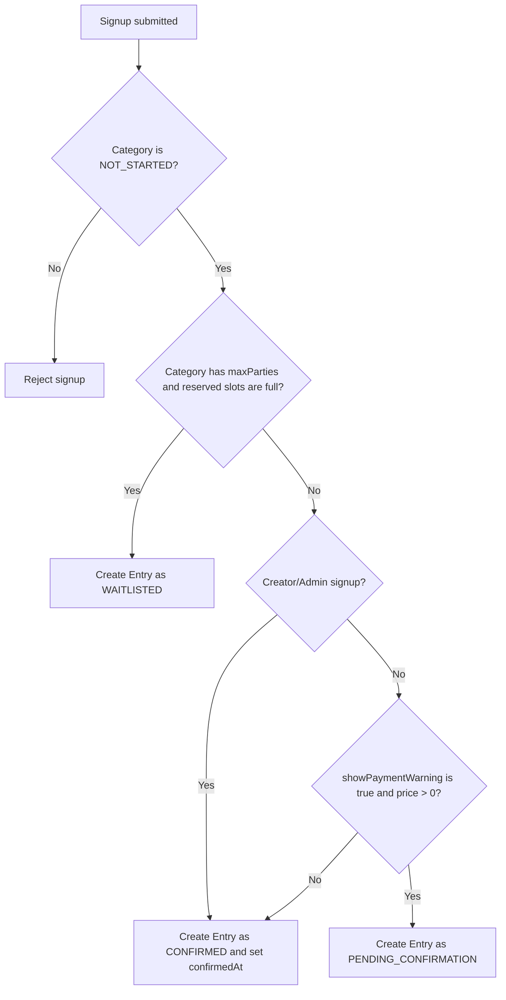
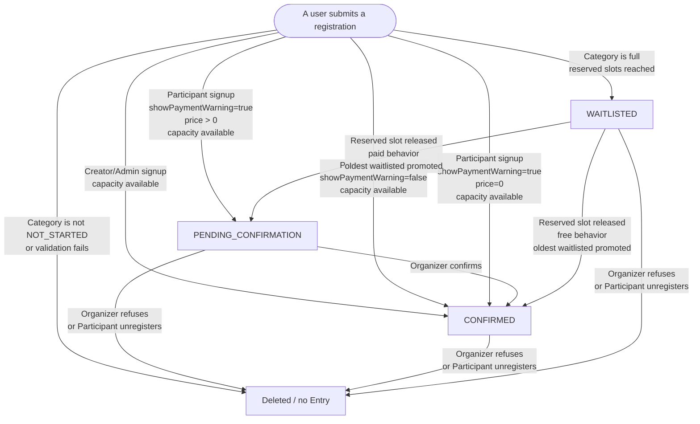

# Registration Workflow

Last updated: 2026-05-21

This document describes the current registration workflow for a Competition Category. It is based on the code in:

- `src/lib/database/db_registration.ts`
- `src/lib/database/db_entry.ts`
- `src/lib/services/category-lifecycle.ts`
- `src/routes/(internal)/competitions/competition_details/[id=integer]/registration/`
- `src/routes/(internal)/(auth)/(organizer)/competition/[id=integer]/manage_registrations/`
- `src/routes/(internal)/api/registrations/[id]/`

## Domain Terms

An Entry is the persisted registration record for one Category. It can include platform users and External Participants.

The persisted Entry statuses are:

- `PENDING_CONFIRMATION`: the Entry has a reserved slot, but the Organizer still needs to confirm the off-platform payment or acceptance.
- `CONFIRMED`: the Entry has a reserved slot and is accepted into the Category. `confirmedAt` is set when the Entry becomes confirmed.
- `WAITLISTED`: the Entry does not reserve a slot. It waits for a reserved slot to be released.

There is no persisted `REFUSED`, `CANCELLED`, or `UNREGISTERED` Entry status. Refusing or unregistering deletes the Entry.

Reserved slots are counted as:

```ts
PENDING_CONFIRMATION + CONFIRMED
```

`WAITLISTED` entries do not count against `Category.maxParties`.

## Competition Settings That Affect Registration

### `registrationOpen`

`Competition.registrationOpen` controls whether the registration UI lets Participants add and submit signups. Organizers can toggle it from the manage registrations page.

The competition details page enables the registration button when:

- the user is logged in **and** `competition.registrationOpen` is true, **or**
- the user is the Competition creator or an Admin (organizer mode)

The registration page allows creating entries when:

- `competition.registrationOpen` is true **or** the user is in organizer mode
- **and** `category.status === NOT_STARTED`

This means the Competition creator can always register entries through the registration page regardless of the `registrationOpen` toggle, as long as the Category has not started.

The mutation in `signUpUsersToCompetition` enforces `category.status === NOT_STARTED`, but it does not currently re-check `competition.registrationOpen` server-side. The UI is the main `registrationOpen` gate for regular Participants.

### `showPaymentWarning`

The create/edit Competition form stores the "Show payment message" toggle as `Competition.showPaymentWarning`.

This flag has two effects:

- Client UX: when it is true and at least one queued Category has `price > 0`, the registration page shows a payment warning popover before submitting.
- Entry status: when it is true and the Category has `price > 0`, regular Participant signups start as `PENDING_CONFIRMATION` if there is capacity.

The implementation treats a Category as free for status purposes when:

```ts
!competition.showPaymentWarning || category.price === 0
```

That means a Category with `price > 0` still auto-confirms when `showPaymentWarning` is false.

## Entry Creation Decision Tree

Before an Entry is created, the server validates that:

- at least one signup was submitted
- referenced Categories exist
- referenced platform users exist
- the Category is still `NOT_STARTED`
- the party size does not exceed `Category.maxPartySize`
- platform users in the party are not already registered in the same Category
- users outside registration-page organizer mode do not exceed the per-creator Entry limit for the Category type
- reusable External Participants are unclaimed and were created by the current user

Registration-page organizer mode currently means the Competition creator or an Admin, as returned by `getDuringCompetitionAccess`. It is not the same check as the manage registrations page access list.

Then the initial Entry status is selected.



The "reserved slots are full" check uses `PENDING_CONFIRMATION + CONFIRMED`, not only confirmed Entries.

## Status Outcomes By Situation

| Situation | Resulting Entry status |
| --- | --- |
| Competition creator/Admin creates an Entry through registration-page organizer mode and the Category has capacity | `CONFIRMED` |
| Participant creates an Entry, `showPaymentWarning = false`, and the Category has capacity | `CONFIRMED` |
| Participant creates an Entry, `showPaymentWarning = true`, `price = 0`, and the Category has capacity | `CONFIRMED` |
| Participant creates an Entry, `showPaymentWarning = true`, `price > 0`, and the Category has capacity | `PENDING_CONFIRMATION` |
| Any new Entry when `Category.maxParties` is reached by reserved slots | `WAITLISTED` |
| Organizer confirms a pending Entry | `PENDING_CONFIRMATION -> CONFIRMED` |
| Organizer refuses a pending or confirmed Entry | Entry is deleted; oldest waitlisted Entry may be promoted |
| Organizer refuses a waitlisted Entry | Entry is deleted; no slot is released |
| Participant unregisters a pending or confirmed Entry | Entry is deleted; oldest waitlisted Entry may be promoted |
| Participant unregisters a waitlisted Entry | Entry is deleted; no slot is released |
| Organizer sends a payment reminder | No status change |
| Organizer publishes table assignments | No status change |

## Entry State Machine



## Waitlist Promotion

Promotion only happens when a reserved slot is released. A reserved slot is released when a `PENDING_CONFIRMATION` or `CONFIRMED` Entry is deleted by refusal or unregistering.

Promotion does not happen when a `WAITLISTED` Entry is deleted because it did not reserve capacity.

When promotion runs:

1. If `Category.maxParties` is not set, promotion exits.
2. The system recounts reserved slots.
3. If there is capacity, it selects the oldest `WAITLISTED` Entry by `createdAt ASC`, then `id ASC`.
4. It promotes that Entry using the same payment rule:
   - `CONFIRMED` when `showPaymentWarning = false` or `price = 0`
   - `PENDING_CONFIRMATION` when `showPaymentWarning = true` and `price > 0`
5. If promoted to `CONFIRMED`, `confirmedAt` is set.
6. Participants are notified. Auto-confirmed promotions use registration-confirmed notifications. Pending promotions use registration-promoted notifications.

## Organizer Management Workflow

The manage registrations page is available to:

- the Competition creator
- an Admin
- a user with an Organizer role assignment for that Competition

It loads all Categories for the Competition, with their Entries. Categories whose `status` is `NOT_STARTED` are shown in the main list. Started, stopped, completed, or canceled Categories are grouped in a collapsed section.

Entries are grouped by status:

- `PENDING_CONFIRMATION`: visible section, with confirm, refuse, and remind actions.
- `WAITLISTED`: collapsed section, with refuse action.
- `CONFIRMED`: collapsed section, sorted by `confirmedAt ASC`, with refuse action.

Bulk actions on the Category card:

- "Remind all pending" sends payment reminders to eligible `PENDING_CONFIRMATION` Entries.
- "Publish tables" assigns sequential table numbers to `CONFIRMED` Entries, ordered by `confirmedAt ASC`, then `createdAt ASC`.

Bulk reminder and publish-table controls are shown only for `NOT_STARTED` Categories in the main manage view. Per-Entry actions are rendered by the Entry status sections.

## Payment Reminders

Payment reminders only apply to `PENDING_CONFIRMATION` Entries.

Single-entry reminders:

- reject non-pending Entries
- reject reminders sent inside the cooldown window
- set `lastRemindedAt`
- send a payment reminder notification

Bulk reminders:

- find all pending Entries in the Category
- skip Entries reminded inside the cooldown window
- set `lastRemindedAt` for eligible Entries
- return both reminded and skipped counts

The cooldown is `PAYMENT_REMINDER_COOLDOWN_MS`, currently 48 hours.

Organizer notes are stripped of HTML and limited to 200 characters before notifications are sent.

## Display Notes

The public registration page and the manage registrations page display capacity information differently from the status transition rule:

- The transition rule treats `PENDING_CONFIRMATION + CONFIRMED` as reserved capacity.
- Some UI count displays use confirmed Entries as the accepted count.

This means a Category can appear to have available accepted seats while new Entries are still waitlisted because pending Entries already reserve those slots.

## Notifications

The workflow emits notifications at these points:

- New auto-confirmed teammate Entries notify other platform users as registration confirmed.
- New pending teammate Entries notify other platform users as registration created.
- New waitlisted Entries notify participants as registration waitlisted.
- Organizer confirmation notifies participants and, when applicable, the creator.
- Organizer refusal notifies participants and, when applicable, the creator.
- Waitlist promotion notifies participants according to whether the promoted Entry is now confirmed or pending.
- Payment reminders notify platform participants and creators who registered others.
- Table assignment publishing notifies participants whose table number changed.
