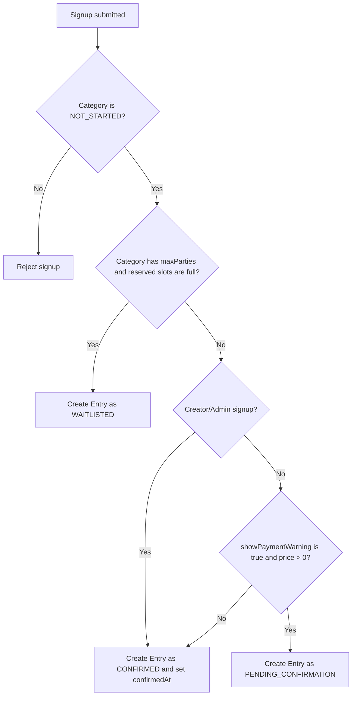
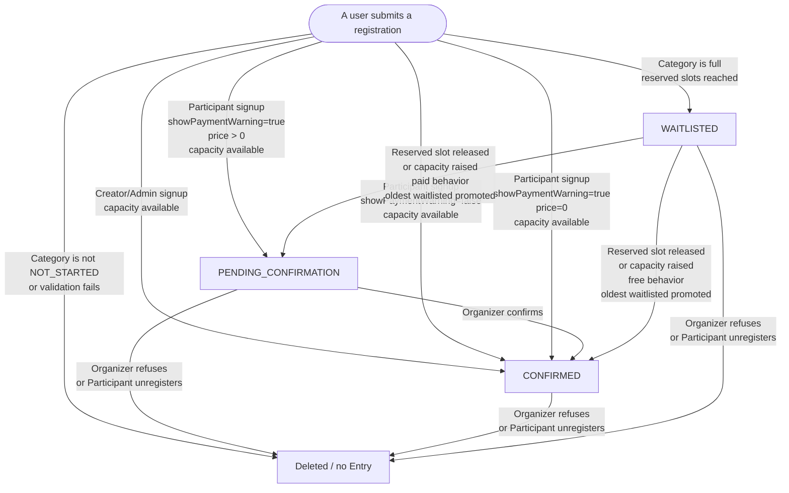

# Registration Workflow

Last updated: 2026-06-17

This document describes the current registration workflow for a Competition Category. It is based on the code in:

- `src/lib/services/registration-workflow.ts`
- `src/lib/database/db_entry.ts`
- `src/lib/services/category-lifecycle.ts`
- `src/routes/(internal)/competitions/competition_details/[id=integer]/registration/`
- `src/routes/(internal)/(auth)/(organizer)/competition/[id=integer]/manage_registrations/`
- `src/routes/(internal)/api/registrations/[id]/`

## Domain Terms

An Entry is the persisted registration record for one Category. It can include platform users and External Participants.

The persisted Entry statuses are:

- `PENDING_CONFIRMATION`: the Entry has a reserved slot, but the Organizer still needs to confirm the off-platform payment or acceptance.
- `CONFIRMED`: the Entry has a reserved slot and is accepted into the Category. `confirmedAt` is set when the Entry becomes confirmed.
- `WAITLISTED`: the Entry does not reserve a slot. It waits for a reserved slot to be released.

There is no persisted `REFUSED`, `CANCELLED`, or `UNREGISTERED` Entry status. Refusing or unregistering deletes the Entry.

Reserved slots are counted as:

```ts
PENDING_CONFIRMATION + CONFIRMED
```

`WAITLISTED` entries do not count against `Category.maxParties`.

## Registration Workflow Module

The Registration workflow Module owns the write-side workflow for Entries:

- `submitRegistration`
- `unregisterRegistration`
- `confirmRegistration`
- `refuseRegistration`

The Module is the server-side seam for registration invariants. Callers pass a `RegistrationActor` and workflow input; the Module validates the actor, route Competition, Category state, capacity, payment behavior, and Entry status transitions. Route actions and API handlers should not perform their own registration state decisions.

Notification side effects are local to workflow outcomes and run after the database transaction. Notification failures are best-effort: they are logged but do not undo a successful Registration mutation.

## Competition Settings That Affect Registration

### `Category.registrationOpen` (per-category, single source of truth)

Registration open/close lives **only** on the Category. There is no competition-wide flag: a
Competition's registration is "open" when at least one `NOT_STARTED` Category is `registrationOpen`
(`hasOpenRegistration(categories)` in `src/lib/utils/registration_utils.ts`, used by the details
button, registration page banner, competition cards, and the explore "open registration" filter).

- `Category.registrationOpen` defaults to `false`: new Categories start closed. Organizers open or close each active Category from its **Manage** menu on the manage registrations page.
- The page-level **Manage** menu offers **Close registration for all categories** (closes every `NOT_STARTED` Category). There is intentionally no "open all": opening is always a per-category decision.
- The competition create form's "Open registration" toggle is form-only: on create it opens every new Category. It is hidden when editing; Categories added later start closed.

A Participant may submit a new registration into a Category only when:

```
category.registrationOpen && category.status === NOT_STARTED
```

"Closed" is independent from "full": reaching `Category.maxParties` still waitlists new entries (it does **not** auto-close); closing is an explicit organizer action.

The competition details page enables the single registration button when:

- the user is logged in **and** at least one `NOT_STARTED` Category is both `registrationOpen` **and** has room, **or**
- the user is the Competition creator or an Admin (organizer mode)

When the button is disabled, its copy reads **"closed"** when no `NOT_STARTED` Category is open for registration, and **"full"** only when open Categories exist but none has room.

The registration page allows creating entries for a Category when:

- the user is in organizer mode (bypasses the per-category flag), **or** `category.registrationOpen` is true
- **and** `category.status === NOT_STARTED`

This means the Competition creator / Admin can always register entries through the registration page regardless of the flag, as long as the Category has not started.

The `submitRegistration` workflow enforces the flag server-side: a closed Category raises `REGISTRATION_CLOSED` unless the server-created actor is in organizer mode, and each submitted Category must be `NOT_STARTED`. Non-organizers changing or removing their own `PENDING` tag claim (`entry-tags.ts`) also require the entry's Category to be open.

Writes are owned by the registration-workflow seam and authorize via `ensureCanManageCompetition` (Competition creator, Admin, or scoped Organizer): `toggleCategoryRegistration({ categoryId, actor })` (`POST /api/categories/[id]/toggle_registration`) and `closeAllCategoryRegistrations({ competitionId, actor })` (`POST /api/competitions/[id]/close_registration`). Neither emits a notification.

#### Scheduled opening (`Category.registrationOpensAt`)

Organizers can schedule a closed, `NOT_STARTED` Category to open at a future time — per category from its **Manage** menu ("Schedule opening" / "Change scheduled opening" / "Cancel scheduled opening"), or for every closed Category at once from the page-level menu ("Schedule opening for all closed categories"). The time is entered in the organizer's local time (`datetime-local`) and stored as UTC. Participants see "Registration opens on …" on the registration page; the manage page shows an "Opens …" badge and the next opening in its status line.

Mechanism (modelled on category auto-stop, QStash-backed):

- `scheduleCategoryRegistrationOpening` / `scheduleAllCategoryRegistrationOpenings` authorize via `ensureCanManageCompetition`, require a future time and a closed `NOT_STARTED` Category, **publish** a delayed QStash message (`registration-open-scheduler.ts`), then store `registrationOpensAt`. `cancelCategoryRegistrationOpening` clears it. Endpoints: `POST|DELETE /api/categories/[id]/schedule_registration`, `POST /api/competitions/[id]/schedule_registration`.
- Messages are never deleted. The body carries `{ categoryId, opensAt }` and the webhook (`POST /api/webhooks/qstash/registration-open`, `registration-open-webhook.ts`) only acts when `opensAt` still equals the stored value — so rescheduling, cancelling, a manual open/close (`toggleCategoryRegistration` clears the schedule) or **close all** (also cancels schedules) turn in-flight messages into no-ops.
- When due, the webhook sets `registrationOpen = true`, clears the schedule (conditional update, so a concurrent manual change wins) and notifies the Competition creator (`REGISTRATION_OPENED`, in-app). A Category that already started or was opened just has its schedule cleared.
- **Delay cap:** QStash limits delays per plan (Free: 7 days). Messages are published at most 6 days ahead (`MAX_HOP_MS`); an early delivery re-publishes the next hop until `opensAt`.
- Without QStash configured (`QSTASH_TOKEN` + `QSTASH_PUBLIC_APP_URL`) the schedule actions are disabled with a hint; manual open/close still works. Local testing needs the ngrok setup used for auto-stop.

#### Category follows ("Notify me when it opens", `CategoryFollow`)

Users can follow a closed Category to be told when its registration opens.

- **Bell visibility** (`canFollowCategory`, `registration_utils.ts`): QStash configured, the Category is `NOT_STARTED` and closed (plain or scheduled), the viewer cannot manage the Competition and holds no Entry in it. Shown in the `CategoryCard` footer on competition details (logged-out visitors see it disabled with a login link) and under the closed / "opens on" message on the registration page.
- **Follow / unfollow:** `POST|DELETE /api/categories/[id]/follow` (`authenticated` guard) → `followCategory` / `unfollowCategory` (`category-follows.ts`). Following upserts the row and resets `notifiedAt` to null (re-arms a notified follow); it rejects started/open Categories and users with an Entry, and answers 503 without QStash. Unfollowing deletes the row, the only path that deletes one.
- **Trigger:** when a Category opens — `toggle_registration` returning `registrationOpen: true`, or the scheduled-opening webhook after a successful open — `triggerCategoryFollowersNotification` publishes an immediate QStash message `{ categoryId }` (`category-followers-notifier.ts`). It is best effort: a failed publish is logged and never fails the open; without QStash nothing is published.
- **Notify webhook** (`POST /api/webhooks/qstash/category-followers`, `category-followers-webhook.ts`): no-op if the Category is no longer open or has started (follows stay pending). Otherwise it reads the pending follows (`notifiedAt = null`), skips users who now hold an Entry, dispatches one `CATEGORY_REGISTRATION_OPENED` intent (email + in-app, linking to the registration page), then sets `notifiedAt` on exactly the follows it read. **At-least-once:** a crash between sending and marking can resend on QStash retry; nothing is lost. Follows are kept after notifying.
- **Organizer view:** the manage-registrations category header shows "N waiting" (pending follows), hidden at 0.

### `showPaymentWarning`

The create/edit Competition form stores the "Show payment message" toggle as `Competition.showPaymentWarning`.

This flag has two effects:

- Client UX: when it is true and at least one queued Category has `price > 0`, the registration page shows a payment warning popover before submitting.
- Entry status: when it is true and the Category has `price > 0`, regular Participant signups start as `PENDING_CONFIRMATION` if there is capacity.

The implementation treats a Category as free for status purposes when:

```ts
!competition.showPaymentWarning || category.price === 0
```

That means a Category with `price > 0` still auto-confirms when `showPaymentWarning` is false.

## Entry Creation Decision Tree

Before an Entry is created, the server validates that:

- at least one signup was submitted
- referenced Categories exist
- referenced platform users exist
- the Category is still `NOT_STARTED`
- the party size does not exceed `Category.maxPartySize`
- platform users in the party are not already registered in the same Category
- users outside registration-page organizer mode do not exceed the per-creator Entry limit for the Category type
- reusable External Participants are unclaimed and were created by the current user

Registration-page organizer mode currently means the Competition creator or an Admin, as returned by `getDuringCompetitionAccess`. It is not the same check as the manage registrations page access list.

Organizer confirmation and refusal actions use the manage-registration rule: Competition creator, Admin, or scoped Organizer for that Competition.

Then the initial Entry status is selected.


```mermaid
flowchart TD
    A[Signup submitted] --> B{Category is NOT_STARTED?}
    B -- No --> R[Reject signup]
    B -- Yes --> C{Category has maxParties and reserved slots are full?}
    C -- Yes --> W[Create Entry as WAITLISTED]
    C -- No --> D{Creator/Admin signup?}
    D -- Yes --> F[Create Entry as CONFIRMED and set confirmedAt]
    D -- No --> E{showPaymentWarning is true and price > 0?}
    E -- Yes --> P[Create Entry as PENDING_CONFIRMATION]
    E -- No --> F
```

The "reserved slots are full" check uses `PENDING_CONFIRMATION + CONFIRMED`, not only confirmed Entries.

## Status Outcomes By Situation

| Situation | Resulting Entry status |
| --- | --- |
| Competition creator/Admin creates an Entry through registration-page organizer mode and the Category has capacity | `CONFIRMED` |
| Participant creates an Entry, `showPaymentWarning = false`, and the Category has capacity | `CONFIRMED` |
| Participant creates an Entry, `showPaymentWarning = true`, `price = 0`, and the Category has capacity | `CONFIRMED` |
| Participant creates an Entry, `showPaymentWarning = true`, `price > 0`, and the Category has capacity | `PENDING_CONFIRMATION` |
| Any new Entry when `Category.maxParties` is reached by reserved slots | `WAITLISTED` |
| Organizer confirms a pending Entry | `PENDING_CONFIRMATION -> CONFIRMED` |
| Organizer refuses a pending or confirmed Entry | Entry is deleted; oldest waitlisted Entry may be promoted |
| Organizer refuses a waitlisted Entry | Entry is deleted; no slot is released |
| Participant unregisters a pending or confirmed Entry | Entry is deleted; oldest waitlisted Entry may be promoted |
| Participant unregisters a waitlisted Entry | Entry is deleted; no slot is released |
| Organizer edits a Category (e.g. raises `maxParties`) | Oldest waitlisted Entries are promoted until reserved slots are full again |
| Organizer edits a Category and lowers `maxParties` | No status change; existing reservations are never demoted |
| Organizer sends a payment reminder | No status change |
| Organizer publishes table assignments | No status change |

## Entry State Machine


```mermaid
flowchart TD
    Submit(["A user submits a registration"])
    Pending["PENDING_CONFIRMATION"]
    Confirmed["CONFIRMED"]
    Waitlisted["WAITLISTED"]
    NoEntry["Deleted / no Entry"]

    Submit -->|"Category is not NOT_STARTED<br/>or validation fails"| NoEntry
    Submit -->|"Category is full<br/>reserved slots reached"| Waitlisted
    Submit -->|"Creator/Admin signup<br/>capacity available"| Confirmed
    Submit -->|"Participant signup<br/>showPaymentWarning=false<br/>capacity available"| Confirmed
    Submit -->|"Participant signup<br/>showPaymentWarning=true<br/>price=0<br/>capacity available"| Confirmed
    Submit -->|"Participant signup<br/>showPaymentWarning=true<br/>price > 0<br/>capacity available"| Pending

    Pending -->|"Organizer confirms"| Confirmed

    Pending -->|"Organizer refuses<br/>or Participant unregisters"| NoEntry
    Confirmed -->|"Organizer refuses<br/>or Participant unregisters"| NoEntry
    Waitlisted -->|"Organizer refuses<br/>or Participant unregisters"| NoEntry

    Waitlisted -->|"Reserved slot released<br/>or capacity raised<br/>paid behavior<br/>oldest waitlisted promoted"| Pending
    Waitlisted -->|"Reserved slot released<br/>or capacity raised<br/>free behavior<br/>oldest waitlisted promoted"| Confirmed
```

## Waitlist Promotion

Promotion happens when capacity becomes available:

- A reserved slot is released: a `PENDING_CONFIRMATION` or `CONFIRMED` Entry is deleted by refusal or unregistering. One Entry is promoted.
- An organizer saves the competition edit form: every edited Category runs promotion repeatedly (`promoteWaitlistedAfterCapacityChange`) until reserved slots reach `maxParties` or the waitlist is empty. This runs inside the `updateCompetition` transaction; notifications are sent after it commits. Lowering `maxParties` below the reserved count demotes nobody.

Promotion does not happen when a `WAITLISTED` Entry is deleted because it did not reserve capacity.

When promotion runs:

1. If `Category.maxParties` is not set, promotion exits.
2. The system recounts reserved slots.
3. If there is capacity, it selects the oldest `WAITLISTED` Entry by `createdAt ASC`, then `id ASC`.
4. It promotes that Entry using the same payment rule:
   - `CONFIRMED` when `showPaymentWarning = false` or `price = 0`
   - `PENDING_CONFIRMATION` when `showPaymentWarning = true` and `price > 0`
5. If promoted to `CONFIRMED`, `confirmedAt` is set.
6. Participants are notified. Auto-confirmed promotions use registration-confirmed notifications. Pending promotions use registration-promoted notifications.

## Organizer Management Workflow

The manage registrations page is available to:

- the Competition creator
- an Admin
- a user with an Organizer role assignment for that Competition

It loads all Categories for the Competition, with their Entries. Categories whose `status` is `NOT_STARTED` are shown in the main list. Started, stopped, completed, or canceled Categories are grouped in a collapsed section.

Entries are grouped by status:

- `PENDING_CONFIRMATION`: visible section, with confirm, refuse, and remind actions.
- `WAITLISTED`: collapsed section, with refuse action.
- `CONFIRMED`: collapsed section, sorted by `confirmedAt ASC`, with refuse action.

Bulk actions on the Category card:

- "Remind all pending" sends payment reminders to eligible `PENDING_CONFIRMATION` Entries.
- "Publish tables" assigns sequential table numbers to `CONFIRMED` Entries, ordered by `confirmedAt ASC`, then `createdAt ASC`.

Bulk reminder and publish-table controls are shown only for `NOT_STARTED` Categories in the main manage view. Per-Entry actions are rendered by the Entry status sections.

## Payment Reminders

Payment reminders only apply to `PENDING_CONFIRMATION` Entries.

Single-entry reminders:

- reject non-pending Entries
- reject reminders sent inside the cooldown window
- set `lastRemindedAt`
- send a payment reminder notification

Bulk reminders:

- find all pending Entries in the Category
- skip Entries reminded inside the cooldown window
- set `lastRemindedAt` for eligible Entries
- return both reminded and skipped counts

The cooldown is `PAYMENT_REMINDER_COOLDOWN_MS`, currently 48 hours.

Organizer notes are stripped of HTML and limited to 200 characters before notifications are sent.

## Display Notes

Capacity displays for registration use reserved slots:

```ts
PENDING_CONFIRMATION + CONFIRMED
```

`getCompetitionCategories` exposes this as `reservedSlots` while preserving `totalEntries` as confirmed Entries for During Competition views. Public details, public registration, and manage registrations should use reserved slots when showing seats filled or spots left.

On competition cards (home and explore, whenever a current user is known), each category row shows the user's own Entry statuses as compact `EntryRegistrationStatusBadge` markers (#120). An Entry is the user's when they are a participant **or** its creator (`isUserEntry` in `registration_utils.ts`; `userEntryFilter` in `db_competition.ts`). From `sm` up, a row lists every status in lifecycle order (confirmed → pending → waitlisted) with a count when there's more than one; below `sm`, only the most urgent (waitlisted > pending > confirmed). The capacity count stays neutral. Categories with the user's entries are always shown (up to 3); the "+N more" line carries the most urgent status of hidden entries. See `docs/features/home-registration-status-120/`.

## Notifications

The workflow emits notifications at these points:

- New auto-confirmed teammate Entries notify other platform users as registration confirmed.
- New pending teammate Entries notify other platform users as registration created.
- New waitlisted Entries notify participants as registration waitlisted.
- Organizer confirmation notifies participants and, when applicable, the creator.
- Organizer refusal notifies participants and, when applicable, the creator — except the acting organizer, who is never notified of their own removal (#123).
- Waitlist promotion notifies participants according to whether the promoted Entry is now confirmed or pending.
- Payment reminders notify platform participants and creators who registered others.
- Table assignment publishing notifies participants whose table number changed.
- Tag claim rejection notifies the entry creator (`TAG_REJECTED`); confirmation is not notified.
- A scheduled opening that fires notifies the Competition creator (`REGISTRATION_OPENED`, in-app only).
- Any opening (manual or scheduled) notifies the Category's pending followers (`CATEGORY_REGISTRATION_OPENED`, email + in-app), asynchronously via QStash.

## Participant Tag Claims

During registration a registrant may claim at most one **Participant Tag** per entry, creating an **Entry Tag** with status `PENDING` (see [glossary](../glossary.md)). The organizer confirms or rejects it on the manage-registrations page, or assigns one directly as `CONFIRMED`.

Tag claims are **independent of the registration status**. The `EntryTag` is never altered by registration status transitions: a `WAITLISTED` entry keeps its claim, and the claim rides through unchanged when the entry is promoted to `PENDING_CONFIRMATION` or `CONFIRMED`. Pricing follows the claim — a `PENDING` or `CONFIRMED` claim whose `TagCategory` has a `priceOverride` drives the displayed/charged price; a rejection reverts to the base category price with any difference reconciled off-platform (consistent with `showPaymentWarning`). Only `CONFIRMED` tags appear publicly on the results ranking.
